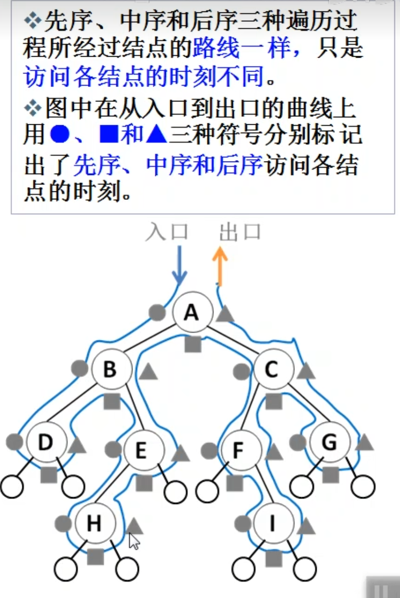

# ACM算法

## 一、基础算法

### 搜索

记忆化搜索：对递归树做了剪枝，搜索过的子树不再重复搜索，直接返回存储值

## 二、数据结构

### 二叉树

二叉树先序遍历：`中 -> 左 -> 右`

二叉树中序遍历：`左 -> 中 -> 右`，一个节点在访问时它的左子树一定访问完了

二叉树后序遍历：`左 -> 右 -> 中`，一个节点在访问时它的左右子树一定都访问完了

### 单调栈

- 下一个更高的数据在哪？
- 小于(大于)该值的数据都出栈
- 栈中只存下标

### 单调队列

- 滑动窗口最值

## 三、字符串

## 四、动态规划

### 线性DP

### 背包DP

## 五、图论

## 六、数论和线性代数

## 七、组合数学

## 八、计算几何

## 九、概率

## 十、博弈论

