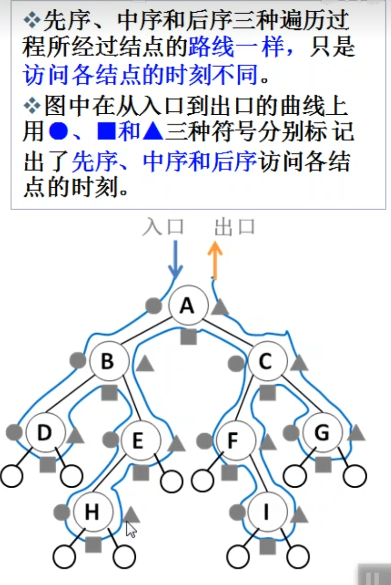
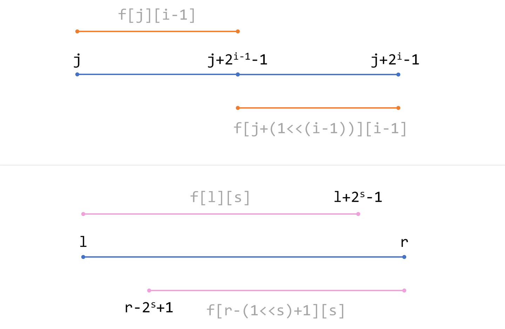
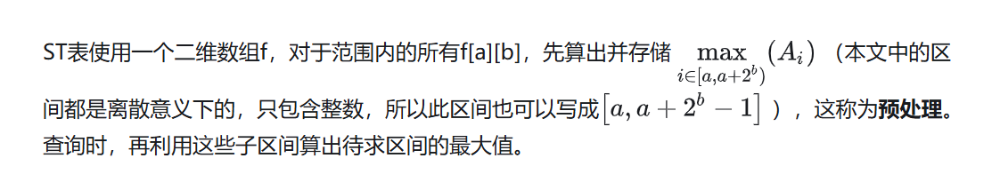
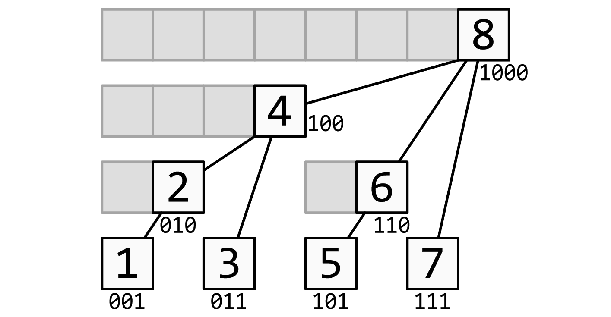

# ACM算法


## 一、基础算法

### 搜索

记忆化搜索：对递归树做了剪枝，搜索过的子树不再重复搜索，直接返回存储值


### 二分查找
```c++
//在升序序列中二分查找某数 x 的位置，二分区间为 [left,right]，如果不存在，返回-1
int arr[N];
int binarySearch(int left, int right, int v) {
    while (left <= right) {
        int mid = (left + right) >> 1;
        if (arr[mid] == v) return mid;
        else if (arr[mid] < v) left = mid + 1;
        else right = mid -1;
    }
    return -1;
}
```


## 二、数据结构


### 二叉树

二叉树先序遍历：`中 -> 左 -> 右`

二叉树中序遍历：`左 -> 中 -> 右`，一个节点在访问时它的左子树一定访问完了

二叉树后序遍历：`左 -> 右 -> 中`，一个节点在访问时它的左右子树一定都访问完了




### ST表
```c++
// 计算1~n的log2值
for (int i = 2; i <= n; ++i)
    Log2[i] = Log2[i / 2] + 1;

// f[a][b]，a存储位置索引(1~n)，b存储2进制长度，f[a][b]存储a~a+2^b-1范围的最值
int f[MAXN][21]; // 第二维的大小根据数据范围决定，不小于log(MAXN)
for (int i = 1; i <= n; ++i)
    f[i][0] = read(); // 读入数据
for (int i = 1; i <= 20; ++i)
    for (int j = 1; j + (1 << i) - 1 <= n; ++j)
        f[j][i] = max(f[j][i - 1], f[j + (1 << (i - 1))][i - 1]);

// 初始化、计算
for (int i = 0; i < n; ++i) {
    int l = read(), r = read();
    // 区间长度所对应的log2值(不超过长度)
    int s = Log2[r - l + 1];
    // 查询、左右边界2进制长度查询
    printf("%d\n", max(f[l][s], f[r - (1 << s) + 1][s]));
}
```

ST 表（Sparse Table，稀疏表）是用于解决 可重复贡献问题 的数据结构

   

目标：
- 区间最值


预处理，倍增


### 单调栈

- 下一个更高的数据在哪？
- 小于(大于)该值的数据都出栈
- 栈中只存下标


### 单调队列

- 滑动窗口最值


### 并查集
```c++
/**
    朴素并查集
*/ 
// p[]存储每个点的祖宗节点，s[]只有祖宗节点的有意义，表示祖宗节点所在集合中的点的数量
int p[N], s[N];

// 返回x的祖宗节点
int find(int x) {
    if (p[x] != x) p[x] = find(p[x]);
    return p[x];
}

// 判断是否在同一个集合
bool same(int x, int y) {
    return find(x) == find(y);
} 

// 集合合并
void merge(int x, int y) {
    p[find(x)] = find(y);
    s[p[y]] += s[p[x]];
}

// 初始化并查集，编号 1~n
for (int i = 1; i <= n; i++) {
    p[i] = i;
    s[i] = 1;
}
```

目标：
1.将两个集合合并
2.询问两个元素是否在一个集合中
时间复杂度基本上是O(1);

原理：
1.每一个集合用树来维护，每一个集合的编号是根节点，查找是去看他爸爸是不是根节点，不是再向上，所以每一个节点都要存储他的父节点，p[x]就是x的父节点
2.判断根节点 if（p[x]==x）;
3.集合合并，直接让其中一个变成儿子（子节点）,px是x的编号，py是y的编号，插入p[x]=y;
4.求x的集合编号，while(p[x]!=x)x=p[x],因为他的循环次数取决于树的高度，时间复杂度会很高，所以将其优化为：把所有子节点都指向根节点：（路径压缩）；


### 树状数组
```c++
// 编号1~n
int[N] tree;

// 二进制末尾1
int lowbit(int x) {
    return x & (-x);
}

// 当前更新，更新父节点链，保证树上父节点链上的值为前缀和值
void update(int i, int v) {
    while (i <= n) {
        tree[i] += v;
        i += lowbit(i);
    }
}

// 区间查询，二进制1统计
int query(int i) {
    int sum = 0;
    while (i > 0) {
        sum += tree[i];
        i -= lowbit(i);
    }
    return sum;
}
```

目标：
1.单点更新
2.区间查询


前缀和
基于二进制位为1的前缀和统计
每个节点的编号加上二进制位的末尾(右侧)1，就可以得到父节点的编号(反过来同理获取子节点)





### 线段树
```c++
// 线段树要开N的4倍空间
struct node {
    int l, r;
    // sum区间和、lazy子树区间更新延迟标记
    long long sum, lazy; 
} tree[N * 4];

// 原始数据
int w[N];

// 向上更新父节点
void pushup(int p) {
    tree[p].sum = tree[p << 1].sum + tree[p << 1 | 1].sum;
}

// 向下更新子树，清空当前节点的lazy标记
void pushdown(int p) {
    node l = tree[p << 1];
    node r = tree[p << 1 | 1];
    if (tree[p].lazy) {
        l.lazy += tree[p].lazy;
        r.lazy += tree[p].lazy;
        l.sum += (long long)(l.r - l.l + 1) * tree[p].lazy;
        r.sum += (long long)(r.r - r.l + 1) * tree[p].lazy;
        tree[p].lazy = 0;
    }
}

// 区间[1~n]，p当前节点、l当前节点左边界、r当前节点右边界
void build(int p, int l, int r) {
    tree[p].l = l;
    tree[p].r = r;
    tree[p].lazy = 0;
    if (l == r) {
        tree[p].sum = w[p];
        return;
    }
    int mid = (l + r) >> 1;
    build(p << 1, l, mid);
    build(p << 1 | 1, mid + 1, r);
    // 向上更新父节点
    pushup(p);
}

// 区间更新、p当前节点、l更新左边界(不变)、r更新右边界(不变)，v更新值
void update(int p, int l, int r, int v) {
    // 完全覆盖当前节点
    if (tree[p].l >= l && tree[p].r <= r) {
        tree[p].sum += (long long)(tree[p].r - tree[p].l + 1) * v;
        tree[p].lazy += v;
        return;
    }
    pushdown(p);
    int mid = (tree[p].l + tree[p].r) >> 1;
    // 左节点重叠
    if (l <= mid) update(p << 1, l, r);
    // 右节点重叠
    if (r > mid) update(p << 1 | 1, l, r);
    pushup(p);
}

// 区间查询、p当前节点、l查询左边界(不变)、r查询右边界(不变)
long long query(int p, int l, int r){
    // 完全覆盖当前节点，更新过程中能保证父节点lazy被清除了
    if (tree[p].l >= l && tree[p].r <= r) return tree[p].sum;
    // 向下更新lazy
    pushdown(p);
    int mid = (tree[p].l + tree[p].r) >> 1;
    long long sum = 0;
    // 左节点重叠
    if (l <= mid) sum += query(p << 1, l, r);
    // 右节点重叠
    if (r > mid) sum += query(p << 1 | 1, l, r);
    return sum;
}

// 初始化
build(1, 1, n);
```

目标：
1.区间查询
2.区间更新


父子关系：
父节点 x/2下取整 等价于 x >> 1;
左儿子 2x 等价于 x << 1;
右儿子 2x + 1 等价于 x << 1 | 1


## 三、字符串


## 四、动态规划

### 线性DP


### 背包DP


## 五、图论


## 六、数论


## 七、线性代数


## 八、组合数学


## 九、计算几何


## 十、概率


## 十一、博弈论


