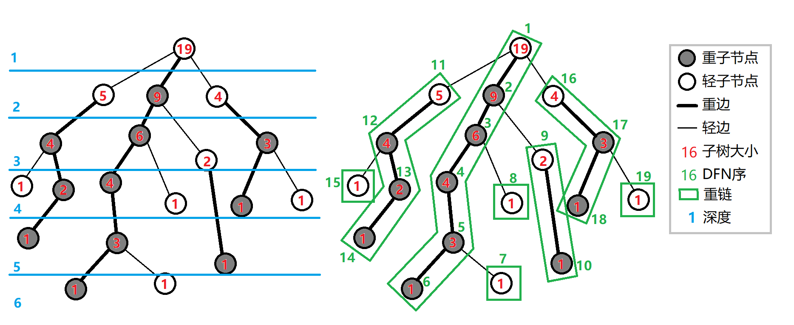

# ACM算法

`E06 线性DP 最长公共子串`

## 一、基础算法

### 快速幂
```c++
// 计算 a^b % mod
long long qpow(long long a, long long b, long long mod) {
    long long res = 1;
    a %= mod;  // 先对底数取模，防止溢出

    while (b) {
        if (b & 1) res = res * a % mod;  // 如果当前位是1，则乘上a
        a = a * a % mod;  // a 每轮平方
        b >>= 1;  // b 右移一位，相当于除以2
    }

    return res;
}
```

对b进行二进制拆分

### 大数运算


#### 大数加法
```c++
string add(string a, string b) {
    // 保证a的长度长
    if (a.length() < b.length()) swap(a, b);

    // c进位
    int carry = 0;
    string res = "";

    // 低位到高位
    reverse(a.begin(), a.end());
    reverse(b.begin(), b.end());

    for (size_t i = 0; i < a.size(); ++i) {
        int sum = a[i] - '0' + carry;
        if (i < b.size()) sum += b[i] - '0';
        res += (sum % 10) + '0';
        carry = sum / 10;
    }
    if (carry) res += carry + '0';
    reverse(res.begin(), res.end());
    return res;
}
```

#### 大数减法
```c++
string sub(string a, string b) {
    // 借位
    int borrow = 0;
    string res = "";

    // 低位到高位
    reverse(a.begin(), a.end());
    reverse(b.begin(), b.end());

    for (size_t i = 0; i < a.size(); ++i) {
        int diff = a[i] - '0' - borrow;
        if (i < b.size()) diff -= b[i] - '0';
        if (diff < 0) {
            diff += 10;
            borrow = 1;
        } else borrow = 0;
        res += diff + '0';
    }

    // 清空高位0
    while (res.size() > 1 && res.back() == '0') res.pop_back();

    reverse(res.begin(), res.end());
    return res;
}
```

#### 大数乘法
```c++
string mul(string a, string b) {
    vector<int> res(a.size() + b.size(), 0);
    reverse(a.begin(), a.end());
    reverse(b.begin(), b.end());

    for (size_t i = 0; i < a.size(); ++i)
        for (size_t j = 0; j < b.size(); ++j)
            res[i + j] += (a[i] - '0') * (b[j] - '0');

    // 数值拍平
    for (size_t i = 0; i < res.size(); ++i) {
        if (res[i] >= 10) {
            res[i + 1] += res[i] / 10;
            res[i] %= 10;
        }
    }

    // 清空高位0
    while (res.size() > 1 && res.back() == 0) res.pop_back();

    string ans;
    // 拼接字符串
    for (int i = res.size() - 1; i >= 0; --i)
        ans += res[i] + '0';
    return ans;
}
```


#### 大数除法
```c++
// 大数除以小精度整数
string div(string a, int b, int &r) {
    string res;
    r = 0;

    // 高位到低位除法
    for (int i = 0; i < a.size(); ++i) {
        r = r * 10 + (a[i] - '0');
        res += (r / b) + '0';
        r %= b;
    }
    // 去前导零
    size_t pos = res.find_first_not_of('0');
    return (pos == string::npos) ? "0" : res.substr(pos);
}
```


### 排序


#### 冒泡排序


### 离散化
```c++
vector<int> vals(a + 1, a + n + 1);
sort(vals.begin(), vals.end());
vals.erase(unique(vals.begin(), vals.end()), vals.end());

for (int i = 1; i <= n; ++i)
    a[i] = lower_bound(vals.begin(), vals.end(), a[i]) - vals.begin();
```


### 搜索

DFS、BFS
记忆化搜索：对递归树做了剪枝，搜索过的子树不再重复搜索，直接返回存储值


#### DFS
```c++
vector<int> g[N];
bool vis[N]; // 是否访问过

void dfs(int u) {
    vis[u] = true;

    for (int v : g[u]) {
        if (!vis[v]) {
            dfs(v);
        }
    }
}
```

深度优先搜索


#### BFS
```c++
vector<int> g[N];
bool vis[N]; // 是否访问过
int dist[N]; // 起点到每个点的最短距离

void bfs(int start) {
    memset(vis, 0, sizeof vis);
    memset(dist, -1, sizeof dist);

    queue<int> q;
    q.push(start);
    vis[start] = true;
    dist[start] = 0;

    while (!q.empty()) {
        int u = q.front(); q.pop();

        for (int v : g[u]) {
            if (!vis[v]) {
                vis[v] = true;
                dist[v] = dist[u] + 1;
                q.push(v);
            }
        }
    }
}
```

宽度优先搜索


### 二分查找
```c++
//在升序序列中二分查找某数 x 的位置，二分区间为 [left,right]，如果不存在，返回-1
int arr[N];
int binarySearch(int left, int right, int v) {
    while (left <= right) {
        int mid = (left + right) >> 1;
        if (arr[mid] == v) return mid;
        else if (arr[mid] < v) left = mid + 1;
        else right = mid -1;
    }
    return -1;
}
```


搜索零点问题


#### 三分查找


### 差分
差分 是一个非常实用又简单的技巧，特别适合处理：
- 区间加
- 区间减
- 快速构造前缀变化
- 离线处理区间操作


#### 一维差分
```c++
const int N = 1e5 + 10;
int a[N], b[N];
int n, m;

// 差分原理，构造前缀和还原该元素，
// l 加上、r + 1减去
void add(int l, int r, int k) {
    b[l] += k;
    b[r + 1] -= k;
}

int main() {
    cin >> n >> m;
    for (int i = 1; i <= n; ++i) {
        cin >> a[i];
        b[i] = a[i] - a[i - 1];  // 差分初始化
    }

    while (m--) {
        int l, r, k;
        cin >> l >> r >> k;
        add(l, r, k);
    }

    // 还原
    for (int i = 1; i <= n; ++i) {
        b[i] += b[i - 1];
        cout << b[i] << " ";
    }
}
```


#### 二维差分
```c++
const int N = 1010;
int a[N][N], b[N][N];
int n, m, q;

void insert(int x1, int y1, int x2, int y2, int k) {
    b[x1][y1] += k;
    b[x2 + 1][y1] -= k;
    b[x1][y2 + 1] -= k;
    b[x2 + 1][y2 + 1] += k;
}

int main() {
    cin >> n >> m >> q;
    
    // 输入原始矩阵 a，并初始化差分矩阵 b
    for (int i = 1; i <= n; ++i)
        for (int j = 1; j <= m; ++j) {
            cin >> a[i][j];
            insert(i, j, i, j, a[i][j]); // 初始值单点插入到差分数组中
        }

    // 多次操作：对矩形加值
    while (q--) {
        int x1, y1, x2, y2, k;
        cin >> x1 >> y1 >> x2 >> y2 >> k;
        insert(x1, y1, x2, y2, k);
    }

    // 用二维前缀和还原最终矩阵
    for (int i = 1; i <= n; ++i)
        for (int j = 1; j <= m; ++j)
            b[i][j] = b[i][j] + b[i - 1][j] + b[i][j - 1] - b[i - 1][j - 1];

    // 输出结果矩阵
    for (int i = 1; i <= n; ++i) {
        for (int j = 1; j <= m; ++j)
            cout << b[i][j] << " ";
        cout << endl;
    }

    return 0;
}
```


### 分块
```c++
#include <iostream>
#include <cmath>
using namespace std;

const int N = 1e5 + 10;
int a[N], block[N];  // a 是原数组，block 是每块的和
int n, m;
int len;  // 每块的大小
int belong[N]; // belong[i] 表示下标 i 属于哪一块

void build() {
    len = sqrt(n);  // 每块长度
    for (int i = 1; i <= n; ++i) {
        belong[i] = (i - 1) / len + 1;
        block[belong[i]] += a[i];
    }
}

void update(int x, int k) {
    block[belong[x]] += k - a[x];
    a[x] = k;
}

int query(int l, int r) {
    int res = 0;
    if (belong[l] == belong[r]) {
        for (int i = l; i <= r; ++i) res += a[i];
    } else {
        for (int i = l; belong[i] == belong[l]; ++i) res += a[i];
        for (int i = belong[l] + 1; i < belong[r]; ++i) res += block[i];
        for (int i = r; belong[i] == belong[r]; --i) res += a[i];
    }
    return res;
}
```

分块是一种典型的空间换时间的数据结构技巧，非常适合处理：
- 区间查询（区间和、最大最小值、异或等）
- 区间修改（加值、赋值等）
- 单点修改 + 区间查询


### 莫队
```c++
// 问题：给定一个数组 a[1..n] 和 m 次查询，每次查询区间 [l, r] 中不同数字的个数

const int N = 1e5 + 10;
// cnt[x] 表示值为 x 的数有几个（用于去重）
// ans[N] 每个查询的答案
//  block 分块大小 = sqrt(n)
int a[N], cnt[N], ans[N], block;
int n, m, res = 0;

struct Query {
    int l, r, id;
    bool operator<(const Query &q) const {
        int lb = l / block, rb = q.l / block;
        // 首先根据l的块编号排序
        if (lb != rb) return lb < rb;

        // 奇偶块交替让 R 指针来回少一点，从而让滑动距离更短
        return (lb & 1) ? (r < q.r) : (r > q.r); // 可选奇偶优化
    }
} q[N];

// 添加一个位置
void add(int x) {
    if (cnt[x]++ == 0) ++res;
}

// 删除一个位置
void remove(int x) {
    if (--cnt[x] == 0) --res;
}

int main() {
    ios::sync_with_stdio(false);
    cin.tie(nullptr);

    cin >> n >> m;
    block = sqrt(n); // 每块大小
    for (int i = 1; i <= n; ++i) cin >> a[i];

    for (int i = 0; i < m; ++i) {
        cin >> q[i].l >> q[i].r;
        q[i].id = i;
    }

    sort(q, q + m);

    int l = 1, r = 0;
    for (int i = 0; i < m; ++i) {
        while (l > q[i].l) add(a[--l]);
        while (r < q[i].r) add(a[++r]);
        while (l < q[i].l) remove(a[l++]);
        while (r > q[i].r) remove(a[r--]);

        ans[q[i].id] = res;
    }

    for (int i = 0; i < m; ++i)
        cout << ans[i] << '\n';

    return 0;
}
```

离线查询

莫队算法（Mo's Algorithm）：常用于离线区间查询问题的高效解法，特别适合处理：
- 区间种类数统计（如：区间不同数字个数）
- 区间众数、区间最大最小值等（需稍加改写）
- 数据不修改，纯查询（不支持动态修改）

核心原理：避免重复计算
不用每次都从头计算每个区间，而是通过维护一个滑动窗口 [L, R]，只对变化部分进行加删操作！


### 偏序


#### 一维偏序
```c++
// 问题：求前缀中小于当前数的个数

const int N = 1e5 + 10;
// a[x] 原数组
// c[x] 树状数组计数器，用于动态求前缀和（求比a[i]值小的）
int a[N], c[N], res[N];
int n;

int lowbit(int x) { return x & -x; }

void add(int x, int v) {
    while (x < N) c[x] += v, x += lowbit(x);
}

int query(int x) {
    int res = 0;
    while (x > 0) res += c[x], x -= lowbit(x);
    return res;
}

int main() {
    cin >> n;
    for (int i = 1; i <= n; ++i) cin >> a[i];

    // 离散化，避免树状数组无法存储
    vector<int> nums(a + 1, a + n + 1);
    sort(nums.begin(), nums.end());
    nums.erase(unique(nums.begin(), nums.end()), nums.end());
    for (int i = 1; i <= n; ++i)
        a[i] = lower_bound(nums.begin(), nums.end(), a[i]) - nums.begin() + 1;

    // 树状数组统计
    for (int i = 1; i <= n; ++i) {
        res[i] = query(a[i] - 1);  // 查询有多少比当前小
        add(a[i], 1);              // 加入当前值
    }

    for (int i = 1; i <= n; ++i)
        cout << res[i] << " ";
    cout << "\n";
}
```

离散化 + 树状数组


问题：给你一个长度为 n 的数组 a[1..n]，你需要对每个位置 i 统计满足某个条件的前缀/后缀信息，比如：
- 有多少个 j < i，使得 a[j] < a[i]

#### 二维偏序
```c++
// 题目： 给定 n 个点 (x, y)，求对于每个点，有多少个点 (x', y') 满足：x' ≤ x 且 y' ≤ y —— 即它的左下角有多少点
struct Point {
    int x, y, id;
    bool operator<(const Point &p) const {
        if (x != p.x) return x < p.x;
        return y < p.y;
    }
};

const int N = 1e5 + 10;
int bit[N], ans[N], n;
Point a[N];

int lowbit(int x) { return x & -x; }

void add(int x, int v) {
    while (x < N) bit[x] += v, x += lowbit(x);
}

int query(int x) {
    int res = 0;
    while (x > 0) res += bit[x], x -= lowbit(x);
    return res;
}

int main() {
    cin >> n;
    for (int i = 1; i <= n; ++i) {
        cin >> a[i].x >> a[i].y;
        a[i].id = i;
    }

    // 离散化 y，保证数组数组可以存储y的值
    vector<int> ys;
    for (int i = 1; i <= n; ++i) ys.push_back(a[i].y);
    sort(ys.begin(), ys.end());
    ys.erase(unique(ys.begin(), ys.end()), ys.end());
    for (int i = 1; i <= n; ++i)
        a[i].y = lower_bound(ys.begin(), ys.end(), a[i].y) - ys.begin() + 1;

    // 排序 + 树状数组
    // 排序后保证了x的升序，接下来只需要对y进行统计即可
    sort(a + 1, a + n + 1);
    for (int i = 1; i <= n; ++i) {
        ans[a[i].id] = query(a[i].y);
        add(a[i].y, 1);
    }

    for (int i = 1; i <= n; ++i)
        cout << ans[i] << "\n";
}
```

离线、排序 + 树状数组
1. 按 x 升序排序（固定第一维）
2. 在排序后的过程中，用树状数组维护 y 的信息
3. 每次查询 y 的前缀和，就能统计当前点左下角有多少点


#### 三维偏序


## 二、数据结构


### ST表
```c++
// 计算1~n的log2值
for (int i = 2; i <= n; ++i)
    Log2[i] = Log2[i / 2] + 1;

// f[a][b]，a存储位置索引(1~n)，b存储2进制长度，f[a][b]存储a~a+2^b-1范围的最值
int f[MAXN][21]; // 第二维的大小根据数据范围决定，不小于log(MAXN)
for (int i = 1; i <= n; ++i)
    f[i][0] = read(); // 读入数据
for (int i = 1; i <= 20; ++i)
    for (int j = 1; j + (1 << i) - 1 <= n; ++j)
        f[j][i] = max(f[j][i - 1], f[j + (1 << (i - 1))][i - 1]);

// 初始化、计算
for (int i = 0; i < n; ++i) {
    int l = read(), r = read();
    // 区间长度所对应的log2值(不超过长度)
    int s = Log2[r - l + 1];
    // 查询、左右边界2进制长度查询
    printf("%d\n", max(f[l][s], f[r - (1 << s) + 1][s]));
}
```

ST 表（Sparse Table，稀疏表）是用于解决 可重复贡献问题 的数据结构

   

目标：
- 区间最值


预处理，倍增


### 单调栈
```c++
// 找每个元素左边第一个比它小的数
vector<int> a;  // 输入数组
stack<int> stk; // 单调递增栈（栈中存的是下标）
vector<int> left(a.size());

for (int i = 0; i < a.size(); ++i) {
    while (!stk.empty() && a[stk.top()] >= a[i]) {
        stk.pop();
    }
    left[i] = stk.empty() ? -1 : stk.top(); // 左边第一个比它小的
    stk.push(i);
}
```

单调栈是一种保持单调性的栈结构，适合用于处理：
- 前/后一个更大/更小的元素
- 连续区间的最大/最小值贡献
- 直方图最大矩形


- 下一个更高的数据在哪？
- 小于(大于)该值的数据都出栈
- 栈中只存下标


### 单调队列
```c++
// 滑动窗口最大值（递减队列）
vector<int> maxSlidingWindow(vector<int>& nums, int k) {
    deque<int> dq;  // 存下标，维护一个单调递减的队列
    vector<int> res;

    for (int i = 0; i < nums.size(); ++i) {
        // 1. 删除队尾所有比当前小的元素（它们不会再成为最大）
        while (!dq.empty() && nums[dq.back()] <= nums[i]) {
            dq.pop_back();
        }
        dq.push_back(i);

        // 2. 移除滑出窗口的元素（下标小于 i - k + 1）
        if (dq.front() <= i - k) dq.pop_front();

        // 3. 当前窗口形成时记录最大值（队首就是最大）
        if (i >= k - 1) res.push_back(nums[dq.front()]);
    }
    return res;
}
```

- 滑动窗口最值


### 并查集
```c++
/**
    朴素并查集
*/ 
// p[]存储每个点的祖宗节点，s[]只有祖宗节点的有意义，表示祖宗节点所在集合中的点的数量
int p[N], s[N];

// 返回x的祖宗节点
int find(int x) {
    if (p[x] != x) p[x] = find(p[x]);
    return p[x];
}

// 判断是否在同一个集合
bool same(int x, int y) {
    return find(x) == find(y);
} 

// 集合合并
void merge(int x, int y) {
    p[find(x)] = find(y);
    s[p[y]] += s[p[x]];
}

// 初始化并查集，编号 1~n
for (int i = 1; i <= n; i++) {
    p[i] = i;
    s[i] = 1;
}
```

目标：
1.将两个集合合并
2.询问两个元素是否在一个集合中
时间复杂度基本上是O(1);

原理：
1.每一个集合用树来维护，每一个集合的编号是根节点，查找是去看他爸爸是不是根节点，不是再向上，所以每一个节点都要存储他的父节点，p[x]就是x的父节点
2.判断根节点 if（p[x]==x）;
3.集合合并，直接让其中一个变成儿子（子节点）,px是x的编号，py是y的编号，插入p[x]=y;
4.求x的集合编号，while(p[x]!=x)x=p[x],因为他的循环次数取决于树的高度，时间复杂度会很高，所以将其优化为：把所有子节点都指向根节点：（路径压缩）；


### 树状数组
```c++
// 编号1~n
int[N] tree;

// 二进制末尾1
int lowbit(int x) {
    return x & (-x);
}

// 当前更新，更新父节点链，保证树上父节点链上的值为前缀和值
void update(int i, int v) {
    while (i <= n) {
        tree[i] += v;
        i += lowbit(i);
    }
}

// 区间查询，二进制1统计
int query(int i) {
    int sum = 0;
    while (i > 0) {
        sum += tree[i];
        i -= lowbit(i);
    }
    return sum;
}
```

目标：
1.单点更新
2.区间查询


前缀和
基于二进制位为1的前缀和统计
每个节点的编号加上二进制位的末尾(右侧)1，就可以得到父节点的编号(反过来同理获取子节点)


### 线段树
```c++
// 线段树要开N的4倍空间
struct node {
    int l, r;
    // sum区间和、lazy子树区间更新延迟标记
    long long sum, lazy; 
} tree[N * 4];

// 原始数据
int w[N];

// 向上更新父节点
void pushup(int p) {
    tree[p].sum = tree[p << 1].sum + tree[p << 1 | 1].sum;
}

// 向下更新子树，清空当前节点的lazy标记
void pushdown(int p) {
    node l = tree[p << 1];
    node r = tree[p << 1 | 1];
    if (tree[p].lazy) {
        l.lazy += tree[p].lazy;
        r.lazy += tree[p].lazy;
        l.sum += (long long)(l.r - l.l + 1) * tree[p].lazy;
        r.sum += (long long)(r.r - r.l + 1) * tree[p].lazy;
        tree[p].lazy = 0;
    }
}

// 区间[1~n]，p当前节点、l当前节点左边界、r当前节点右边界
void build(int p, int l, int r) {
    tree[p].l = l;
    tree[p].r = r;
    tree[p].lazy = 0;
    if (l == r) {
        tree[p].sum = w[p];
        return;
    }
    int mid = (l + r) >> 1;
    build(p << 1, l, mid);
    build(p << 1 | 1, mid + 1, r);
    // 向上更新父节点
    pushup(p);
}

// 区间更新、p当前节点、l更新左边界(不变)、r更新右边界(不变)，v更新值
void update(int p, int l, int r, int v) {
    // 完全覆盖当前节点
    if (tree[p].l >= l && tree[p].r <= r) {
        tree[p].sum += (long long)(tree[p].r - tree[p].l + 1) * v;
        tree[p].lazy += v;
        return;
    }
    pushdown(p);
    int mid = (tree[p].l + tree[p].r) >> 1;
    // 左节点重叠
    if (l <= mid) update(p << 1, l, r);
    // 右节点重叠
    if (r > mid) update(p << 1 | 1, l, r);
    pushup(p);
}

// 区间查询、p当前节点、l查询左边界(不变)、r查询右边界(不变)
long long query(int p, int l, int r){
    // 完全覆盖当前节点，更新过程中能保证父节点lazy被清除了
    if (tree[p].l >= l && tree[p].r <= r) return tree[p].sum;
    // 向下更新lazy
    pushdown(p);
    int mid = (tree[p].l + tree[p].r) >> 1;
    long long sum = 0;
    // 左节点重叠
    if (l <= mid) sum += query(p << 1, l, r);
    // 右节点重叠
    if (r > mid) sum += query(p << 1 | 1, l, r);
    return sum;
}

// 初始化
build(1, 1, n);
```

目标：
1.区间查询
2.区间更新


父子关系：
父节点 x/2下取整 等价于 x >> 1;
左儿子 2x 等价于 x << 1;
右儿子 2x + 1 等价于 x << 1 | 1


## 三、字符串


### 哈希Hash
```c++
// 一维字符串hash
const int M=233;//是我们自己选择的进制数，一般可以选233,2333,10007等质数
const int mod=1e9+7;//一般选一个比较大的质数
long long get(string s)//获取字符串对应的哈希值
{
	long long sum=0;
	for(int i=0;i<s.size();i++) sum=(sum*M+s[i]-'a')%mod;
	return sum;
}

// 一维hash，使用unsigned long long 溢出
typedef unsigned long long int ull;
const int N=1e5+10;
const int M=233;
ull h[N],base[N]; // h[i]记录1~i的前缀hash，// base[i]=M^i
ull query(int l,int r)//获取字符串[l,r]的哈希值
{
    return h[r]-h[l-1]*base[r-l+1];
}
//初始化哈希，1~n
void init(string s)
{
    int n=s.size();
    s="0"+s;//让其下标从1开始
    base[0]=1;
    for(int i=1;i<=n;i++)
    {
        h[i]=h[i-1]*M+s[i];
        base[i]=base[i-1]*M;
    }
}
//求[l1,r1],[l2,r2]子串并的哈希值
ull merge(int l1, int r1, int l2, int r2)
{
    return query(l1, r1) * base[r2 - l2 + 1] + query(l2, r2);
}

// 二维矩阵hash
typedef long long int ll;
const int N=1010;
ll h[N][N],base1[N],base2[N];
int a[N][N],n,m;
//构建，先构建行前缀hash（左到右，base1）,在依靠行前缀hash构造列矩阵hash（上到下）
void init()
{
    base1[0]=base2[0]=1;
    for(int i=1;i<N;i++)
    {
        base1[i]=base1[i-1]*131;
        base2[i]=base2[i-1]*233;
    }
    for(int i=1;i<=n;i++)
        for(int j=1;j<=m;j++)
            h[i][j]=h[i][j-1]*131+a[i][j];//行哈希
    for(int i=1;i<=n;i++)
        for(int j=1;j<=m;j++)
            h[i][j]=h[i-1][j]*233+h[i][j];//列哈希
}
//查询矩阵的哈希值，最前面的最大，需要补充由于长度导致前面少乘的幂运算
ll query(int x1,int y1,int x2,int y2)//查询矩阵的哈希值
{
    return h[x2][y2]-h[x2][y1-1]*base1[y2-y1+1]-h[x1-1][y2]*base2[x2-x1+1]
    +h[x1-1][y1-1]*base1[y2-y1+1]*base2[x2-x1 + 1];
}
```

把一个东西转换成一个大整数，这样比较两个东西是否相等的就只要比较两个整数是否相等就行了


### 字典树
```c++
const int ALPHABET_SIZE = 26; // 字母表大小，26 表示只处理小写英文字母
const int N = 1e5 + 10;        // 结点数上限（可以按题目规模调）

struct Trie {
    int ch[N][ALPHABET_SIZE]; // ch[x][c] 表示节点 x 的第 c 个儿子
    int cnt[N];               // cnt[x] 表示以该点为结尾的字符串数量
    int tot = 1;              // 总节点数（0 是根节点）

    void insert(const string &s) {
        int u = 0; // 从根开始
        for (char c : s) {
            int c_idx = c - 'a';
            if (!ch[u][c_idx]) ch[u][c_idx] = tot++;
            u = ch[u][c_idx];
        }
        cnt[u]++; // 最后一个点标记字符串结尾
    }

    bool search(const string &s) {
        int u = 0;
        for (char c : s) {
            int c_idx = c - 'a';
            if (!ch[u][c_idx]) return false;
            u = ch[u][c_idx];
        }
        return cnt[u] > 0; // 只有插入过的字符串才算匹配成功
    }

    int countPrefix(const string &prefix) {
        int u = 0;
        for (char c : prefix) {
            int c_idx = c - 'a';
            if (!ch[u][c_idx]) return 0;
            u = ch[u][c_idx];
        }

        return dfs_count(u);
    }

    int dfs_count(int u) {
        int res = cnt[u];
        for (int i = 0; i < ALPHABET_SIZE; i++) {
            if (ch[u][i]) {
                res += dfs_count(ch[u][i]);
            }
        }
        return res;
    }
};
```

字典树（Trie，又叫前缀树）是专门用来处理字符串集合的问题，特别适用于以下情况：
- 插入多个字符串
- 查询一个字符串是否存在
- 统计前缀个数
- 支持前缀自动补全 / 匹配
- 有时也可以配合异或操作处理数值（比如最大异或对）


## 四、动态规划

状态转移方程


### 线性DP


#### LIS 最长上升子序列

最长上升子序列的长度
f[i]记录以i结尾的最长上升子序列的长度

可利用手动维护上升子序列（二分+贪心）优化


#### LCS 最长公共子序列

f[i][j]记录 a[1~i]和b[1~j]的最长公共子序列


#### 状态DP


### 背包DP


#### 01背包
```c++
int n, W;
vector<int> w(n), v(n);
vector<int> dp(W + 1, 0);

for (int i = 0; i < n; ++i) {
    // 倒序防止取同一个物品2次
    for (int j = W; j >= w[i]; --j) {
        dp[j] = max(dp[j], dp[j - w[i]] + v[i]);
    }
}

```

问题描述：有 n 个物品和一个容量为 W 的背包，每个物品有重量 w[i] 和价值 v[i]。每个物品只能选一次，问最大总价值是多少


#### 完全背包
```c++
int n, W;
vector<int> w(n), v(n);
vector<int> dp(W + 1, 0);

for (int i = 0; i < n; ++i) {
    // 可重复取，所以正序
    for (int j = w[i]; j <= W; ++j) {
        dp[j] = max(dp[j], dp[j - w[i]] + v[i]);
    }
}
```

问题描述：与 0/1 背包类似，但每种物品可以选任意次。


#### 多重背包
```c++
// 朴素解法
int[] dp = new int[V + 1];
for (int i = 1; i <= N; i++) {
    for (int j = V; j >= v[i]; j--) {  // 逆序（避免重复计算）
        for (int k = 0; k <= s[i] && k * v[i] <= j; k++) {
            dp[j] = Math.max(dp[j], dp[j - k * v[i]] + k * w[i]);
        }
    }
}

// 枚举次数，进行01背包
// 二进制优化
for (int i = 0; i < n; ++i) {
    int count = c[i];
    for (int k = 1; count > 0; k <<= 1) {
        int actual = min(k, count);
        int weight = actual * w[i];
        int value = actual * v[i];
        // 对指定次数进行01背包
        for (int j = W; j >= weight; --j) {
            dp[j] = max(dp[j], dp[j - weight] + value);
        }
        count -= actual;
    }
}
```

问题描述：每个物品最多可以选 c[i] 次
二进制优化原理：


### 区间DP


### 状压DP
```c++
// 一般适用于 n <= 20 的子集问题
int n;
int dp[1 << N];  // dp[mask] 表示子集 mask 对应的最优解
memset(dp, INF, sizeof dp);
dp[0] = 初始值;

for (int mask = 0; mask < (1 << n); ++mask) {
    for (int i = 0; i < n; ++i) {
        if (!(mask >> i & 1)) {  // i 还没选
            int new_mask = mask | (1 << i);
            dp[new_mask] = min(dp[new_mask], dp[mask] + cost(mask, i));
        }
    }
}
```

状压 DP（状态压缩动态规划）是当状态空间很大，但可以用二进制位表示子集/状态的情况下，用一个整数（通常是 bitmask）来表示状态。


### 数位DP
```c++
// 统计 ≤ 某个数的所有数字中，多少个“不包含数字 4”的数

// 记忆化数组：dp[pos][0] 表示某种状态下从 pos 开始的结果
int dp[20][2][2];  // dp[pos][is_limit][is_leading_zero]
vector<int> digits;

// 数字拆位（高到低）
vector<int> get_digits(int x) {
    vector<int> digits;
    while (x) {
        digits.push_back(x % 10);
        x /= 10;
    }
    reverse(digits.begin(), digits.end());
    return digits;
}

// pos 表示当前处理的是数字的第 pos 位（从高位到低位）
// is_limit 表示当前位是否受限制（是否和原来的数一样）（不受限则是 0~9）,决定当前为可选的最大值
// is_leading_zero 表示是否还处于前导零阶段
int dfs(int pos, bool is_limit, bool is_leading_zero) {
    // base case：如果已经处理完所有的数位，返回 1 表示找到一个符合要求的数
    if (pos == digits.size()) return 1;

    // 使用记忆化的 DP 数组来缓存结果
    if (dp[pos][is_limit][is_leading_zero] != -1)
        return dp[pos][is_limit][is_leading_zero];

    int max_digit = is_limit ? digits[pos] : 9;  // 受限时当前位的最大数字，否者最大为 9
    int result = 0;

    for (int d = 0; d <= max_digit; ++d) {
        if (d == 4) continue;  // 不能选 4
        result += dfs(pos + 1, is_limit && (d == max_digit), is_leading_zero && (d == 0));
    }

    return dp[pos][is_limit][is_leading_zero] = result;
}

int solve(int x) {
    digits = get_digits(x);
    memset(dp, -1, sizeof(dp));
    return dfs(0, true, true);
}
```
解决各种“1~n 中满足某种数位限制的数字个数”类问题


### 树型DP
```c++
const int MAX_N = 10000;  // 最大节点数
vector<int> tree[MAX_N];   // 存储树的邻接表

int dp[MAX_N];  // 存储节点的状态或答案，具体含义根据题目而定

// 记忆化搜索，统计子树大小
void dfs(int node, int parent) {
    // 递归到当前节点
    dp[node] = 1;  // 假设初始化状态为1，具体根据题目要求

    // 遍历当前节点的所有子节点
    for (int child : tree[node]) {
        if (child != parent) {  // 确保不会回到父节点
            dfs(child, node);  // 深度优先搜索递归调用
            // 根据子节点的状态更新当前节点的状态
            dp[node] += dp[child];  // 例如求子树节点的总数
        }
    }
}

int n;  // 树的节点数
cin >> n;

// 读取树的边
for (int i = 0; i < n - 1; ++i) {
    int u, v;
    cin >> u >> v;
    tree[u].push_back(v);
    tree[v].push_back(u);
}

// 从根节点开始 DFS
dfs(1, -1);  // 假设节点 1 为根节点，父节点为 -1（没有父节点）

// 输出结果，这里假设我们要输出根节点的答案
cout << dp[1] << endl;
```


## 五、图论

### 图

割点：在一个 无向图 中，如果删除某个点（以及它的所有边），图的连通分量数增加，那么这个点就是割点
桥（割边）：在一个 无向图 中，删除某条边后，图的连通分量数增加，那么这条边就是桥
边双连通分量：
点双连通分量


#### 图的存储


##### 邻接矩阵
```c++
int w[N][N];

// 点a 与 点b之间有 一条边 c
w[a][b] = c;
```


##### 边集数组
```c++
struct edge {int u, v, w;} e[M];

// 点a 与 点b之间有 一条边 c
e[i] = {a, b, c};
```

##### 邻接表
```c++
struct edge {v, w};
vector<edge> e[N];

// 点a 与 点b之间有 一条边 c
e[a].push_back({b, c});
```


##### 链式邻接表
```c++
struct edge {u, v, w};
// 边集
vector<edge> e;
// 记录点所对应所有的边的索引
vector<int> h[N];

// 点a 与 点b之间有 一条边 c
e.push_back({a, b, c});
h[a].push_back(e.size() - 1);
```


##### 链式前向星
```c++
// 边集，next记录下一条边的索引
struct edge {u, v, next} e[M];
// h[i]记录每个顶点头边索引，idx记录总创建的边的索引
int h[N], idx;

// 点a 与 点b之间有 一条边 c
e[idx] = {a, b, h[a]};
h[a] = idx++;
```


### 树

#### 二叉树遍历

二叉树先序遍历：`中 -> 左 -> 右`
二叉树中序遍历：`左 -> 中 -> 右`，一个节点在访问时它的左子树一定访问完了
二叉树后序遍历：`左 -> 右 -> 中`，一个节点在访问时它的左右子树一定都访问完了


#### 树的直径

树中最长路径
DFS两遍
- 任意一点 DFS 找最远点 A
- 以 A 为起点 DFS 找最远点 B
- A-B 的距离即为直径
```c++
void dfs(int u, int fa, int dist) {
    if (dist > max_dist) {
        max_dist = dist;
        node = u;
    }
    for (int v : G[u]) {
        if (v != fa) dfs(v, u, dist + 1);
    }
}
```


#### 树的重心

在一棵 无根树 中，重心（centroid）是这样的一个点：
- 删除这个点后，整棵树会被分成若干棵子树；
- 在这些子树中，最大的子树的节点数最少；
换句话说，这个点使得删除后“最大块”尽可能小。
```c++
int n;
vector<int> G[N];
bool vis[N];
// 用 size[u] 表示以 u 为根的子树大小；
int size[N];
// 用 maxp[u] 表示删掉 u 之后，最大的子树节点数
int maxp[N];
int centroid;
int min_part = INF;

// 从任意一点开始 DFS（例如节点 1）；
void dfs(int u, int parent) {
    size[u] = 1;
    maxp[u] = 0;

    for (int v : G[u]) {
        if (v == parent || vis[v]) continue;

        dfs(v, u);
        size[u] += size[v];
        maxp[u] = max(maxp[u], size[v]);
    }

    maxp[u] = max(maxp[u], n - size[u]);  // 分割后其余部分
    // 希望最大的子树尽量小，maxp[u]考虑到了两边大小
    if (maxp[u] < min_part) {
        min_part = maxp[u];
        centroid = u;
    }
}
```

#### LCA 树的最近公共祖先

倍增法（O(n log n) 预处理，O(log n) 查询）
RMQ + 欧拉序（O(1) 查询）
Tarjan 离线并查集（离线多次 LCA 查询）

```c++
int fa[N][LOG]; // fa[u][k] = u 的第 2^k 级祖先
int depth[N];

void dfs(int u, int father) {
    fa[u][0] = father;
    depth[u] = depth[father] + 1;
    for (int k = 1; (1 << k) <= depth[u]; ++k) {
        fa[u][k] = fa[fa[u][k - 1]][k - 1];
    }
    for (int v : G[u]) {
        if (v != father) dfs(v, u);
    }
}

int lca(int u, int v) {
    // 保证后面计算深度：u>=v
    if (depth[u] < depth[v]) swap(u, v);
    // 向上提升u
    for (int k = LOG - 1; k >= 0; --k)
        if (depth[fa[u][k]] >= depth[v])
            u = fa[u][k];
    if (u == v) return u;
    for (int k = LOG - 1; k >= 0; --k)
        if (fa[u][k] != fa[v][k]) {
            u = fa[u][k];
            v = fa[v][k];
        }
    return fa[u][0];
}
```


### 拓扑排序
```c++
vector<int> graph[N];
int indegree[N]; // 每个点的入度
int n; // n个点

vector<int> topo_sort() {
    queue<int> q;
    vector<int> res;

    // 所有入度为0的点加入队列
    for (int i = 1; i <= n; i++) {
        if (indegree[i] == 0)
            q.push(i);
    }

    while (!q.empty()) {
        int u = q.front(); q.pop();
        res.push_back(u);
        for (int v : graph[u]) {
            indegree[v]--;
            if (indegree[v] == 0)
                q.push(v);
        }
    }

    // 检查是否存在环（不合法）
    if (res.size() < n)
        return {}; // 有环，无法拓扑排序

    return res;
}
```


有向无环图（DAG）,（基于 BFS / 入度法）


### 最短路


#### Dijkstra 单源最短路
```c++
vector<PII> g[N]; // 邻接表：g[u] = {v, w}
int dist[N];      // dist[i] 表示源点到 i 的最短路径
bool vis[N];      // vis[i] 表示点 i 是否已经确定最短距离
int n, m;

void dijkstra(int start) {
    memset(dist, 0x3f, sizeof dist);
    memset(vis, 0, sizeof vis);
    dist[start] = 0;

    priority_queue<PII, vector<PII>, greater<PII>> q;
    q.push({0, start}); // {距离, 点编号}

    while (!q.empty()) {
        auto [d, u] = q.top(); q.pop();

        if (vis[u]) continue;
        vis[u] = true;

        for (auto [v, w] : g[u]) {
            if (dist[v] > dist[u] + w) {
                dist[v] = dist[u] + w;
                q.push({dist[v], v});
            }
        }
    }
}
```


一旦某个点的最短路径被确定，就不会再被更新
适用于边权非负的图（负边可能导致最短路“提前被确定”，错过更优路径）

#### Floyd 任意两点最短路径
```c++
const int INF = INT_MAX;  // 用于表示无穷大，无法到达的点

void floydWarshall(int n, vector<vector<int>>& dist) {
    // dist[i][j] 表示从节点 i 到节点 j 的最短路径长度

    // 通过中间节点 k 更新路径
    for (int k = 0; k < n; ++k) {
        for (int i = 0; i < n; ++i) {
            for (int j = 0; j < n; ++j) {
                if (dist[i][k] != INF && dist[k][j] != INF) {
                    dist[i][j] = min(dist[i][j], dist[i][k] + dist[k][j]);
                }
            }
        }
    }
}
```


#### Bellman-Ford 有负权边
```c++
const int INF = 0x3f3f3f3f;

struct Edge {
    int u, v, w;
};

int dist[N];
int n, m;
vector<Edge> edges;

bool bellman_ford(int start) {
    memset(dist, 0x3f, sizeof dist);
    dist[start] = 0;

    // 最多做 n-1 次松弛
    for (int i = 1; i < n; i++) {
        bool updated = false;
        for (auto e : edges) {
            if (dist[e.u] < INF && dist[e.v] > dist[e.u] + e.w) {
                dist[e.v] = dist[e.u] + e.w;
                updated = true;
            }
        }
        if (!updated) break; // 没更新，提前结束
    }

    // 再做一次：检查负环
    for (auto e : edges) {
        if (dist[e.u] < INF && dist[e.v] > dist[e.u] + e.w) {
            return false; // 有负环
        }
    }

    return true; // 无负环
}
```


对于一个 n 个点的图，最多只需要 进行 n-1 次松弛（最长路径就是n-1条边），就能求出所有最短路径（前提：无负环）


#### SPFA 带负权最短路
```c++
const int INF = 0x3f3f3f3f;
struct Edge {
    int to, weight;
};
vector<Edge> g[N];

int dist[N];      // 最短路径数组
bool in_queue[N]; // 是否在队列中
int cnt[N];       // 统计每个点入队次数（判负环）
int n, m;

bool spfa(int start) {
    memset(dist, 0x3f, sizeof dist);
    memset(in_queue, 0, sizeof in_queue);
    memset(cnt, 0, sizeof cnt);

    queue<int> q;
    dist[start] = 0;
    q.push(start);
    in_queue[start] = true;
    cnt[start]++;

    while (!q.empty()) {
        int u = q.front(); q.pop();
        in_queue[u] = false;

        for (auto &e : g[u]) {
            int v = e.to, w = e.weight;
            if (dist[v] > dist[u] + w) {
                dist[v] = dist[u] + w;
                if (!in_queue[v]) {
                    q.push(v);
                    in_queue[v] = true;
                    cnt[v]++;
                    // 根据Bellman-Ford，最终进行n-1次松弛操作，每个点最多入队n-1次
                    if (cnt[v] >= n) return false; // 存在负环
                }
            }
        }
    }

    return true; // 没有负环
}
```


SPFA（Shortest Path Faster Algorithm）最短路径算法模板，它是 Bellman-Ford 的队列优化版本


### 最小生成树

最小生成树（MST，Minimum Spanning Tree） 是一个图论中的概念，它是一个连接图中所有顶点的树，并且树中所有边的权重之和最小

#### Kruskal
```c++
struct Edge {
    int u, v, weight;
    Edge(int u, int v, int w) : u(u), v(v), weight(w) {}
    bool operator<(const Edge& other) const {
        return weight < other.weight;  // 按边权排序
    }
};

// 并查集（Union-Find）用于判断是否形成环
class UnionFind {
public:
    vector<int> parent, rank;

    UnionFind(int n) {
        parent.resize(n);
        rank.resize(n, 0);
        iota(parent.begin(), parent.end(), 0);  // 初始化，每个点的父节点是它自己
    }

    // 查找根节点，路径压缩
    int find(int x) {
        if (parent[x] != x) {
            parent[x] = find(parent[x]);  // 路径压缩
        }
        return parent[x];
    }

    // 合并两个集合
    bool unionSets(int x, int y) {
        int rootX = find(x);
        int rootY = find(y);

        if (rootX != rootY) {
            // 按秩合并，保持树的平衡
            if (rank[rootX] > rank[rootY]) {
                parent[rootY] = rootX;
            } else if (rank[rootX] < rank[rootY]) {
                parent[rootX] = rootY;
            } else {
                parent[rootY] = rootX;
                rank[rootX]++;
            }
            return true;
        }
        return false;
    }
};

int kruskal(int n, vector<Edge>& edges) {
    UnionFind uf(n);
    int mstWeight = 0;
    int edgesUsed = 0;

    // 将所有边按权重从小到大排序
    sort(edges.begin(), edges.end());

    for (auto& edge : edges) {
        int u = edge.u, v = edge.v, weight = edge.weight;
        
        // 如果没有形成环，则将该边加入生成树
        if (uf.unionSets(u, v)) {
            mstWeight += weight;
            edgesUsed++;
        }

        // 如果生成树包含 n-1 条边，则结束
        if (edgesUsed == n - 1) {
            break;
        }
    }

    // 如果生成树包含的边数小于 n-1，说明图不连通
    if (edgesUsed != n - 1) {
        cout << "图不连通，无法生成最小生成树！" << endl;
        return -1;
    }

    return mstWeight;  // 返回最小生成树的权重和
}
```

Kruskal 算法通过贪心策略，每次选择权重最小的边，逐渐构建生成树，直到生成树包含所有节点


#### Prim
```c++
// Prim 算法
int prim(int n, vector<vector<int>>& graph) {
    vector<int> minCost(n, INF);  // 记录从生成树到其他点的最小边权
    vector<bool> inMST(n, false); // 记录某个节点是否在生成树中
    minCost[0] = 0;  // 从第一个节点开始
    int mstWeight = 0;

    for (int i = 0; i < n; ++i) {
        // 找到当前不在生成树中的最小权边
        int u = -1;
        for (int v = 0; v < n; ++v) {
            if (!inMST[v] && (u == -1 || minCost[v] < minCost[u])) {
                u = v;
            }
        }

        // 如果所有的节点都已加入生成树且图不连通，返回 -1
        if (minCost[u] == INF) {
            return -1;
        }

        // 将 u 节点加入生成树
        inMST[u] = true;
        mstWeight += minCost[u];

        // 更新邻接节点的最小边权
        for (int v = 0; v < n; ++v) {
            if (!inMST[v] && graph[u][v] != INF && graph[u][v] < minCost[v]) {
                minCost[v] = graph[u][v];
            }
        }
    }

    return mstWeight;  // 返回最小生成树的总权重
}
```

Prim 算法是从某个节点开始，逐渐将图中的其他节点通过最小权重的边连接到生成树中，直到所有节点都被连接


### 树链剖分

树链剖分（Heavy-Light Decomposition，简称 HLD）是树上路径查询/修改类题的王炸算法，尤其在支持路径上快速查询、修改、赋值的时候非常高效

将一棵树剖成若干条“重链”和“轻边”，使得：
    - 每条重链内的节点在 DFS 序中是连续的；
    - 在链上用线段树/树状数组维护；
    - 任意一条路径最多跳 O(log n) 次
```c++
const int N = 1e5 + 10;

int n;                      // 节点数
vector<int> G[N];           // 邻接表

int fa[N], dep[N], sz[N];   // 父节点，深度，子树大小
int son[N];                 // 重儿子
int top[N];                 // 所在重链的顶点
int dfn[N], rnk[N], timer;  // DFS序，rnk 是 dfn 的逆映射
int val[N];                 // 原始点权（如需维护点权）

// 第一次 DFS，预处理大小和重儿子
void dfs1(int u, int father) {
    fa[u] = father;
    dep[u] = dep[father] + 1;
    sz[u] = 1;
    int max_size = -1;

    for (int v : G[u]) {
        if (v == father) continue;
        dfs1(v, u);
        sz[u] += sz[v];
        if (sz[v] > max_size) {
            son[u] = v;
            max_size = sz[v];
        }
    }
}

// 第二次 DFS，建 DFS 序和重链 top 标记
void dfs2(int u, int topf) {
    dfn[u] = ++timer;
    rnk[timer] = u;
    top[u] = topf;

    if (!son[u]) return;
    dfs2(son[u], topf);  // 重儿子继续用同一条链

    for (int v : G[u]) {
        if (v != fa[u] && v != son[u]) {
            dfs2(v, v);  // 轻儿子开新链
        }
    }
}

// 线段树维护
struct SegmentTree {
    int tree[N << 2];

    void build(int id, int l, int r) {
        if (l == r) {
            tree[id] = val[rnk[l]]; // 原始权值
            return;
        }
        int mid = (l + r) >> 1;
        build(id<<1, l, mid);
        build(id<<1|1, mid+1, r);
        tree[id] = tree[id<<1] + tree[id<<1|1]; // 示例为求和
    }

    int query(int id, int l, int r, int ql, int qr) {
        if (ql <= l && r <= qr) return tree[id];
        int mid = (l + r) >> 1;
        int res = 0;
        if (ql <= mid) res += query(id<<1, l, mid, ql, qr);
        if (qr > mid)  res += query(id<<1|1, mid+1, r, ql, qr);
        return res;
    }

    void update(int id, int l, int r, int pos, int val) {
        if (l == r) {
            tree[id] = val;
            return;
        }
        int mid = (l + r) >> 1;
        if (pos <= mid) update(id<<1, l, mid, pos, val);
        else update(id<<1|1, mid+1, r, pos, val);
        tree[id] = tree[id<<1] + tree[id<<1|1];
    }
} seg;

// 路径查询（u 到 v 的路径和）
int query_path(int u, int v) {
    int res = 0;
    while (top[u] != top[v]) {
        if (dep[top[u]] < dep[top[v]]) swap(u, v);
        res += seg.query(1, 1, n, dfn[top[u]], dfn[u]);
        u = fa[top[u]];
    }
    if (dep[u] > dep[v]) swap(u, v);
    res += seg.query(1, 1, n, dfn[u], dfn[v]);
    return res;
}

// 修改单点
void update_point(int u, int val) {
    seg.update(1, 1, n, dfn[u], val);
}

// 初始化调用顺序
// 假设点权已经赋值 val[1...n]
dfs1(1, 0);
dfs2(1, 1);
seg.build(1, 1, n);
```

重链：每个节点往“子树最大的儿子”连出的边叫重边，连起来就是重链；
轻链：剩下的那些儿子连接的边叫轻边，连起来是轻链。

树链剖分的目标是：把一棵树拆成尽量少的“段”，以便我们可以用线段树去维护路径上的值



### Tarjan 有向图强连通分量

Tarjan 算法的目标是：把图中所有的强连通分量找出来
找有向图的环
Tarjan 算法基于 DFS 遍历，并通过时间戳、low 值、栈，来判断哪些点属于同一个 SCC

在有向图中，如果一组点之间两两可达（也就是每个点都能走到其他所有点），那么这一组点就构成一个 强连通分量

```c++
const int N = 1e5 + 10;
vector<int> graph[N];
// dfn[u]：时间戳：节点 u 是第几个被访问的
// low[u]：能回溯到的最小 dfn
// 找到 low[u] == dfn[u]，说明 u 是某个强连通分量的根
int dfn[N], low[N], timestamp;
// inStack[u]：标记 u 是否在栈中
bool inStack[N];
// stack：当前递归栈中的点
stack<int> stk;
int scc_id[N], scc_cnt;
vector<int> scc[N]; // scc[i] 存储第 i 个强连通分量里的节点

void tarjan(int u) {
    dfn[u] = low[u] = ++timestamp;
    stk.push(u);
    inStack[u] = true;

    for (int v : graph[u]) {
        if (!dfn[v]) {
            tarjan(v);
            // 回溯更新
            low[u] = min(low[u], low[v]);
        } else if (inStack[v]) {
            // 环,更新能直接到的最小编号
            low[u] = min(low[u], dfn[v]);
        }
    }

    // 回溯到根节点,弹栈
    if (dfn[u] == low[u]) {
        ++scc_cnt;
        int v;
        do {
            v = stk.top(); stk.pop();
            inStack[v] = false;
            scc_id[v] = scc_cnt;
            scc[scc_cnt].push_back(v);
        } while (v != u);
    }
}

void find_scc(int n) {
    timestamp = scc_cnt = 0;
    for (int i = 1; i <= n; i++) {
        if (!dfn[i]) tarjan(i);
    }
}
```


## 六、数论


### GCD 最大公约数
```c++
int gcd(int a, int b) {
    return b == 0 ? a : gcd(b, a % b);
}
```

欧几里得算法


#### GCD EX 扩展欧几里得
```c++
int exgcd(int a, int b, int &x, int &y) {
    // b = 0, gcd(a, b) = a
    // a * 1 + b * 0 = a
    if (b == 0) { x = 1; y = 0; return a; }

    // 递归调用
    int d = exgcd(b, a % b, y, x);
    y -= (a / b) * x;
    return d;
}
```

解 ax + by = gcd(a, b)


### 素数筛

#### 埃氏筛法
```c++
const int N = 1e6 + 10;
bool is_prime[N];

// 筛出 2~n 中所有素数
void eratosthenes(int n) {
    fill(is_prime, is_prime + n + 1, true); // 全部先标记为素数
    is_prime[0] = is_prime[1] = false;

    for (int i = 2; i * i <= n; i++) {
        if (is_prime[i]) {
            // 埃氏筛法优化 从i * (i + n) 开始，因为比i小的因子在前面被筛了
            // 保证每次筛选掉的数i是最小的因子,偏序优化
            for (int j = i * i; j <= n; j += i) {
                is_prime[j] = false;
            }
        }
    }
}
```


#### 欧拉筛法
```c++
const int N = 1e6 + 10;
int primes[N], cnt = 0;
bool is_prime[N]; // 标记是否为合数（false 表示素数）

void euler_sieve(int n) {
    fill(is_prime, is_prime + n + 1, true);
    is_prime[0] = is_prime[1] = false;

    for (int i = 2; i <= n; ++i) {
        if (is_prime[i]) primes[cnt++] = i;
        for (int j = 0; j < cnt && i * primes[j] <= n; ++j) {
            is_prime[i * primes[j]] = false;
            // 保证每个合数只被最小质因子筛一次
            // i 能模 primes[j], 说明能被i筛掉的一定能被primes[j]筛掉,且primes[j]比i小,所以不用继续了
            if (i % primes[j] == 0) break; 
        }
    }
}
```

保证每个合数只被最小质因子筛一次


### 模逆元


#### 费马小定理


#### 扩展欧几里得法


### 欧拉函数


### 中国剩余定理


## 七、线性代数


## 八、组合数学

### 大组合数求模
```c++
using ll = long long;
const int N = 2e5 + 10;
const int MOD = 1e9 + 7;

ll fac[N], inv[N];

// 快速幂
ll qpow(ll a, ll b) {
    ll res = 1;
    while (b) {
        if (b & 1) res = res * a % MOD;
        a = a * a % MOD;
        b >>= 1;
    }
    return res;
}

// 初始化阶乘和逆元
// fac[i] = i! mod 1e9+7
// inv[i] = i!^-1 mod 1e9+7
void init() {
    fac[0] = 1;
    for (int i = 1; i < N; ++i)
        fac[i] = fac[i - 1] * i % MOD;
    inv[N - 1] = qpow(fac[N - 1], MOD - 2);
    for (int i = N - 2; i >= 0; --i)
        inv[i] = inv[i + 1] * (i + 1) % MOD;
}

// C(n, k) = fac[n] * inv[k] * inv[n-k]
ll C(int n, int k) {
    if (k < 0 || k > n) return 0;
    return fac[n] * inv[k] % MOD * inv[n - k] % MOD;
}
```


## 九、计算几何


## 十、概率论


## 十一、博弈论


