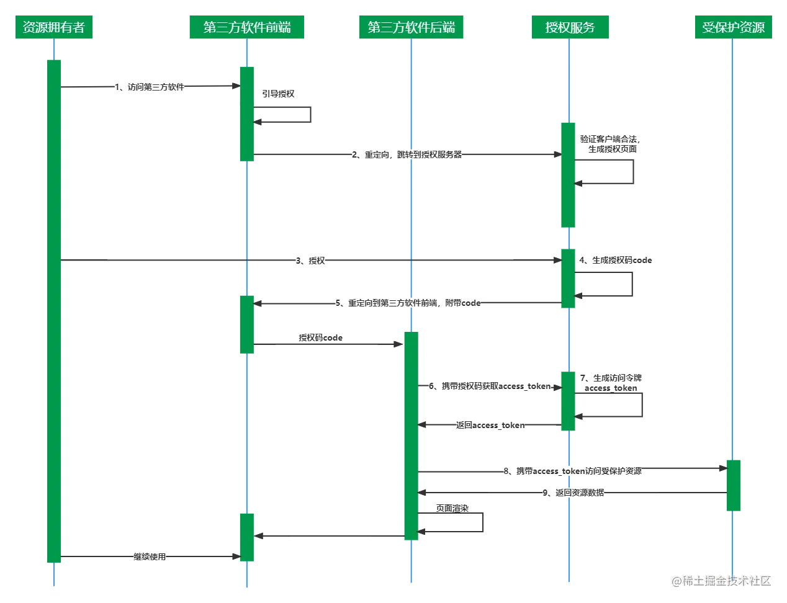
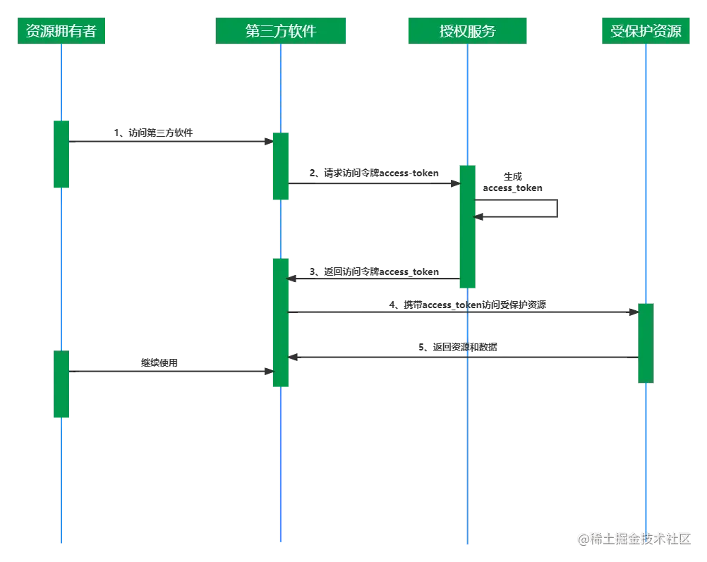
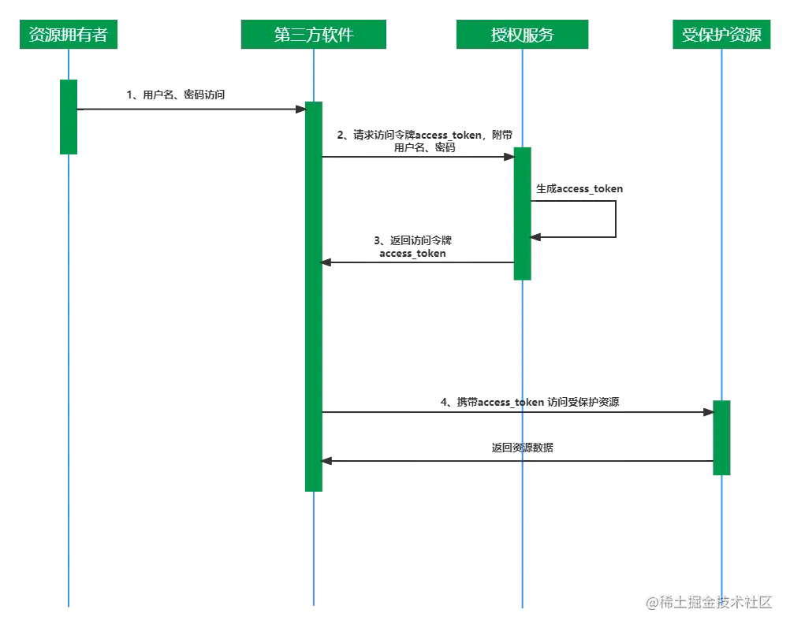
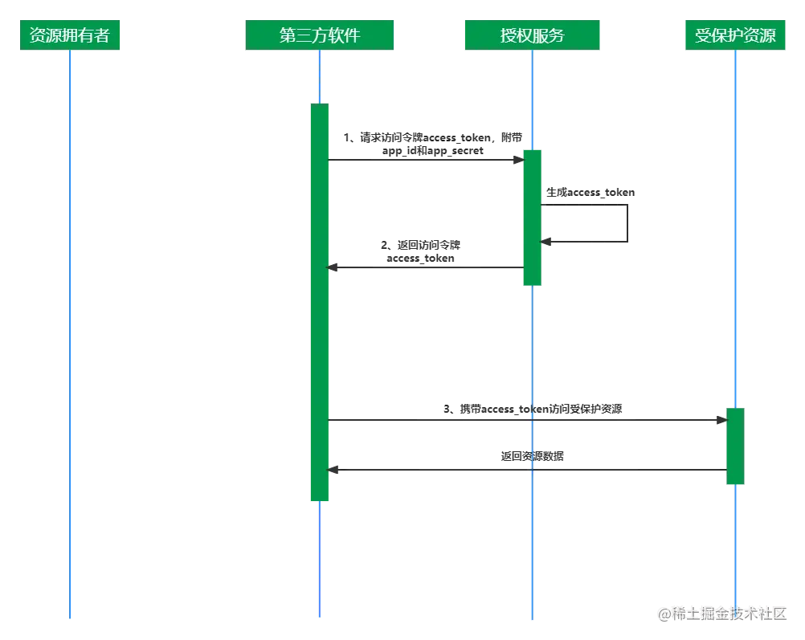

# OAuth2


## 基础介绍


OAuth2:
- 授权码模式: 授权码、access_token
- 简化模式: access_token
- 密码模式: 转发用户名密码、access_token
- 客户端模式: 无需认证(以服务器名义)、access_token







### 授权码

授权码整体流程：（客户端（浏览器）、客户端（后台服务）、授权服务器（第三方认证机构））
```
用户 (Resource Owner)
        |
        | 1. 打开客户端页面
        v
客户端 (Client) ------------------------+
        |                              |
        | 2. 重定向到授权服务器       |
        v                              |
授权服务器 (Auth Server)               |
        | 用户登录并授权               |
        |                              |
        +---------------------------->|
        | 3. 重定向回客户端并携带 code|
        v
客户端 (Server-side) -----------------> 授权服务器 /token
        |                              |
        | 4. 用 code 换 access_token   |
        v                              |
        <-----------------------------+
        | 5. 返回 access_token         |
        v
客户端 (Server-side)
        |
        | 6. 使用 access_token 请求资源
        v
资源服务器 (Resource Server)
        |
        | 返回受保护资源
```