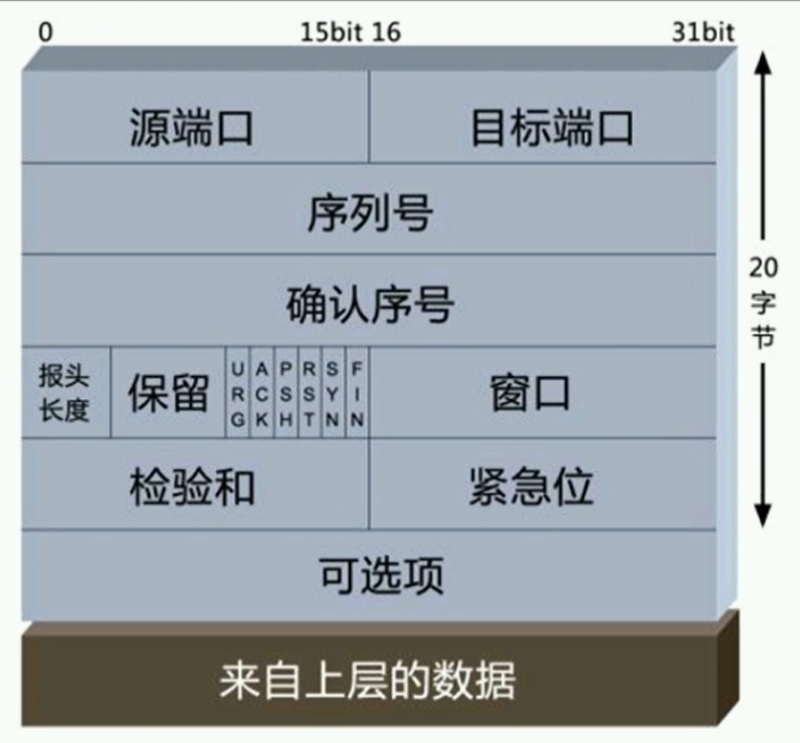
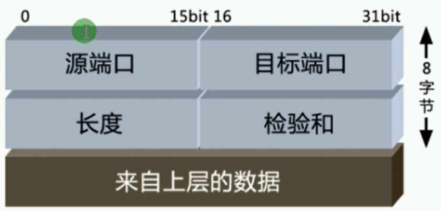
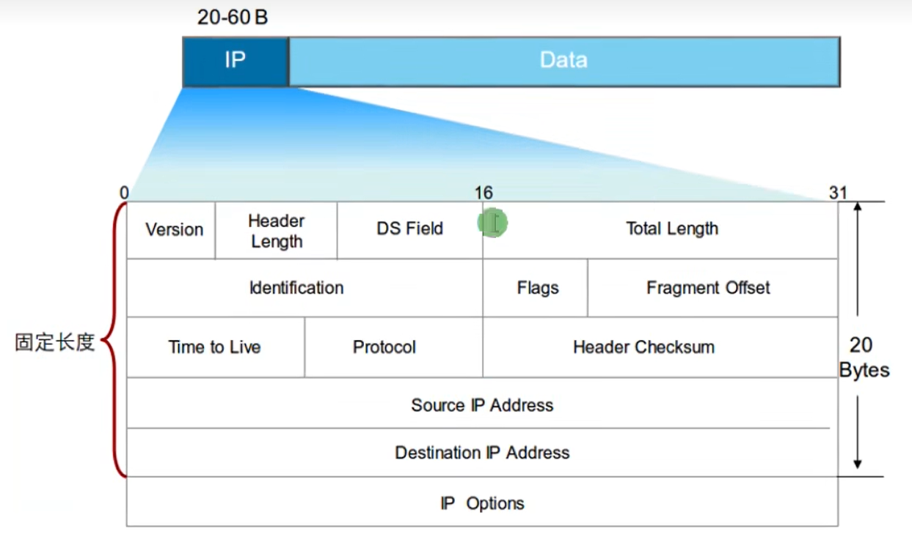
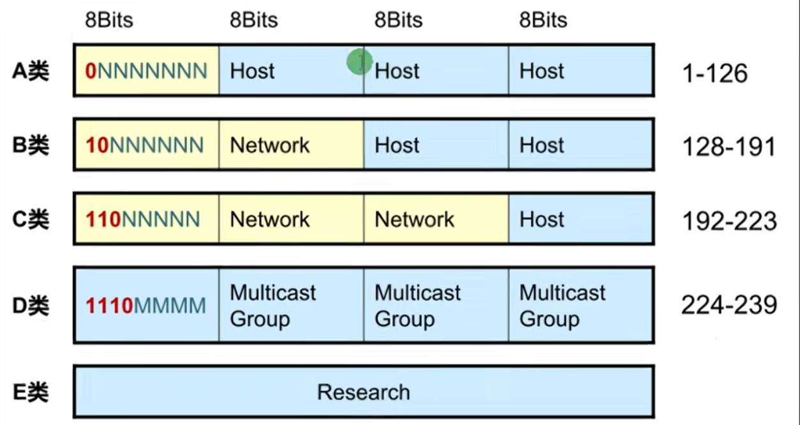
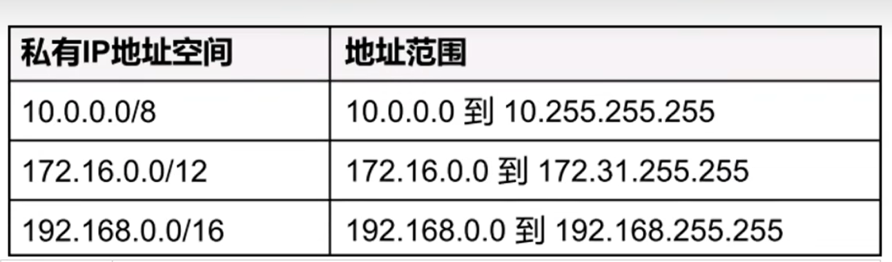
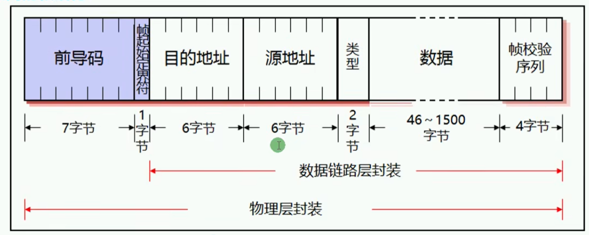

# VRP

`华为数通路由交换HCNA/HCIA：P21`

## 基础介绍


华为网络搭建模拟器


段 -> 包 -> 帧 -> 比特


## 核心内容
```yaml
eNSP:
    AR:
        acl:
        dhcp:
        display:
            arp:
            interface:
            ip:
                routing-table: # 查看路由表
            version:
        interface:
            GigabitEthernet: # x/x/x  进入接口配置模式
                ip:
                    address: # 配置接口 IP 地址
                    route-static: # 配置静态路由
        nat:
        ntp-service:
        system-view:
        vlan:
```


## 网络协议

### DNS

域名解析
应用层协议


### HTTP


### FTP


文件传输协议


### TFTP

简单文件传输协议


### SMTP


### POP3


### IMAP

类似POP3


### TELNET

远程连接


### TCP

传输层协议
基于port



三次握手
syn发给你的序列号、ack确认你给我的
两组syn、ack

累计确认机制、并不是每次对方的syn都必须回复ack
窗口大小机制：告知对方自己剩余窗口容量，用于流量控制

四次挥手ack、fin


### UDP

传输层协议
基于port





### ICMP
```yaml
icmp:
    0:
        0: # Echo Reply
    8:
        0: # Echo Request
```

网络层协议
消息控制协议、type、code


### IP

网络层协议


数据分片
TTL：生存事件


 


网络地址、主机地址、广播地址


### ARP

网络层协议
根据ip获取mac地址


### Ethernet

以太网协议、局域网组网技术


数据帧大小：64~1518
MTU: 46~1500
目标地址、源地址、类型、帧校验序列：18

数据链路层
- LLC子层
- MAC子层

MAC地址：48位、6字节