# VRP

`华为数通路由交换HCNA/HCIA：P56`

## 基础介绍


华为网络搭建模拟器


段 -> 包 -> 帧 -> 比特


## 核心内容
```yaml
eNSP:
    AR: # 路由器
        aaa: # aaa 认证模式
            local-aaa-user:
            local-user:
                password: # 登录密码
                    ciper: # 加密
                privilege: # 权限
                    level: # 权限级别
                service-type: # 可用服务 
                    telnet:
        acl: # 访问控制
            rule:
        arp:
            broadcast: # 允许arp广播
                enable:
        bgp:
        dhcp: #   
            select:
                global:
                interface:
            server:
                excluded-ip-address:
                dns-list:
                lease:
                static-bind:
                    mac-address:
                    ip-address:
        dir:
        display:
            arp:
            http:
                server:
            interface: # 显示网络接口
                brief:
            ip:
                interface: # 查看 接口 ip
                routing-table: # 查看路由表
            mac-address: # mac地址表
            ospf:
                interface:
                lsdb: # 链路状态数据库、地图，邻接关系
                peer: # 查看 ospf邻居，邻居关系
            saved-configuration: # 保存的配置
            startup: # 查看系统启动配置参数
            telnet:
                server:
                    status:
            this: # 当前视图的运行配置
            users: # 登录用户
            version:
        ftp:
        interface: # 网络接口
            GigabitEthernet: # x/x/x  进入接口配置模式
            loopback: # 回环接口
                dot1q:
                    termination:
                        vid: # 配置子接口vid
                ip:
                    address: # 配置接口 IP 地址
                    route-static: # 配置静态路由
                link-protocol:
        ip:
            route-static: # 配置 静态路由
        nat:
        ntp-service:
        quit: # 退出
        ospf:
            area: # 区域
            authentication-mode: # ospf认证
                md5:
                ciper:
            cost: # 开销
            default-route-advertise: # 发布缺省路由
            dr-priority: # DR优先级 
            import-route: # 引入路由
                direct:
            router-id: # Rotuer ID
            timer: # 
                hello:
            network: # 区域宣告，加入ospf
        reset: # 重启进程
            ospf process:
        rip: # 开启rip进程，缺省为1
            filter-policy: # 过滤策略
            import-route: # 注入路由信息
            metricin: # 接收rip 跳数增加量，默认0
            metricout: # 发送rip 跳数增加量，默认1
            network: # 宣告网络，指定运行rip的接口，无掩码，大类
            poison-reverse: # 毒性反转
            silent-interface: # 抑制接口，只收不发rip
                all:
            split-horizon: # 水平分隔
            undo:
                rip in: # 禁用 接收rip
                rip out: # 禁用 发送rip
            version: # 指定版本
        save: # 保存 系统配置，vrpcfg.zip
        startup:
            saved-configuration:
            system-software:
        sysname: # 修改设备名称
        system-view:
        telnet:
            server:
                enable:
        tftp:
            get:
        user-interface: # 用户连接接口
            console:
            vty:
                authentication-mode: # 修改认证模式
                    aaa:
                    password:
                set:
                    authentication:
                        password: # 设置登录密码
                user:
                    privilege: # 设置用户权限
                        level:
        vlan:
    LSW:
        display:
            gvrp:
                statistics:
                status:
            interface:
            ip:
                interface:
                routing-table:
            mac-address: # mac地址表
            port: # 显示 端口
                vlan:
            stp:
                brief:
            vlan:
        gvrp:
            registration: # 
        interface:
            g0/0/x:
                duplex:
                    full:
                    half:
                gvrp:
                port: 
                    default:
                        vlan: # 设置 端口vlan号
                    hybrid:
                        pvid:
                            vlan:
                        tagged:
                            vlan:
                        untagged:
                            vlan:
                    link-type: # 设置 端口类型
                        access:
                        hybrid:
                        trunk:
                    trunk:
                        allow-pass: # 配置trunk端口允许发送的vlan
                            vlan:
                                all:
                                to:
                        pvid: # 默认vlan端口号
                speed: # 接口速率
                    10:
                    100:
                    1000:
                    auto-negotiation:
                undo:
                    negotiation auto: # 关闭 速率协商
                vlan:
                    ip:
                        addr: # vlanif接口，三层交换机
        stp:
            cost: # 路径开销
            disable:
            mode: # STP模式
                mstp:
                rstp:
                stp:
            pathcost-standard: # 开销标准
            port:
                priority:
            priority: # BID优先级
            root: # 指定主备根桥
        vlan:
            batch: # 批量创建vlan
```
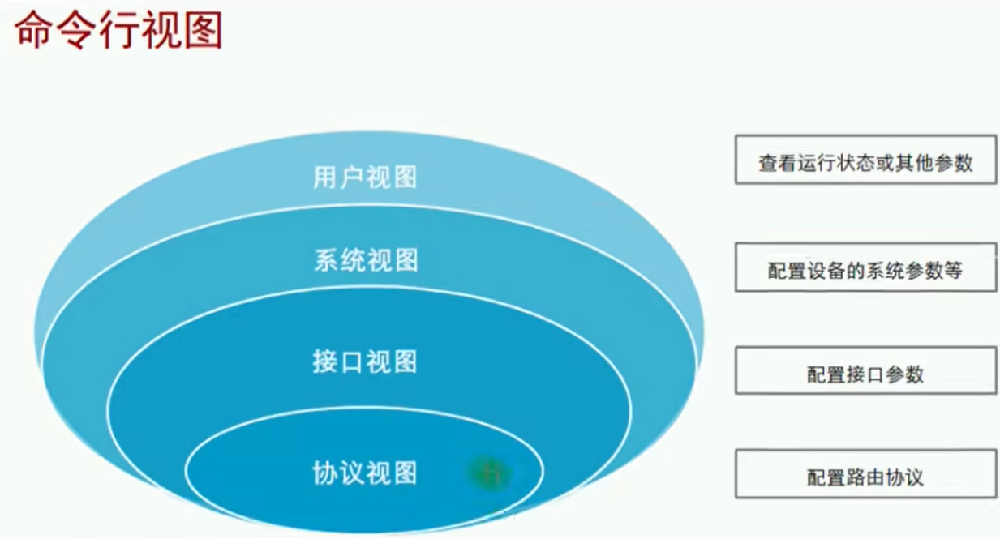
- 用户视图
- 系统视图
- 接口视图
- 协议视图


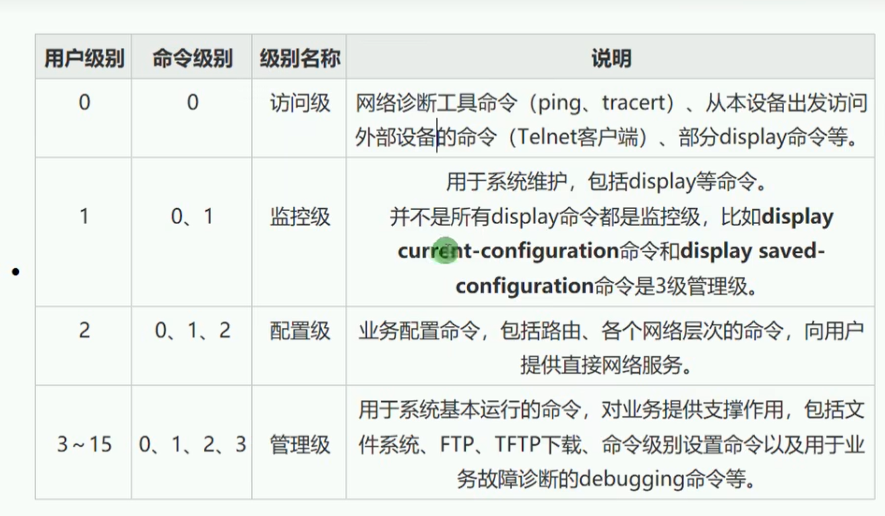
- 访问级别
- 监控级别
- 配置级别
- 管理级别

认证级别
- password密码认证
- aaa用户名密码认证


### 交换机

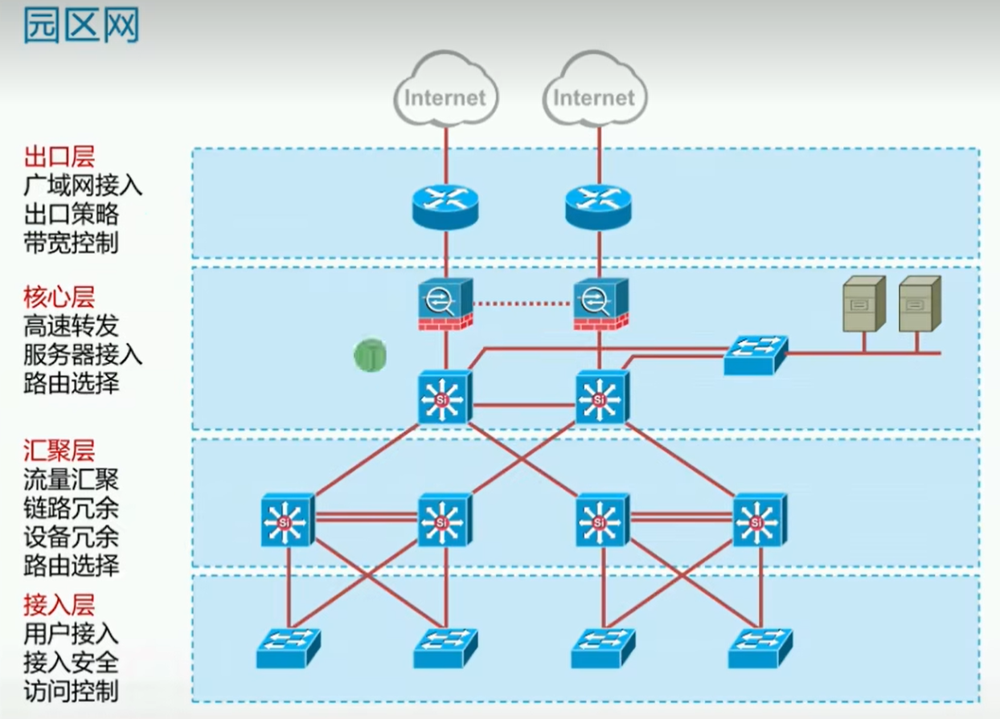

MAC地址表
学习、泛洪、转发、更新
广播帧、组播帧、单播帧
默认每条记录保存300秒


#### VLAN

vlan核心：
- 打上tag
- 剥离tag
- pvid和允许tag

pc、路由器不能接受带tag的帧


分隔广播域、灵活构建虚拟工作组
Vlan范围：0-4095
不同vlan间设备默认无法通讯，需借助第三层设备才能互通

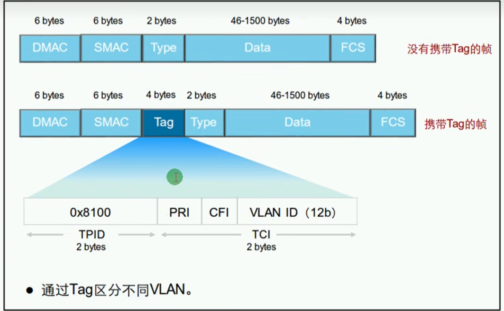


VLAN链路类型：
- Access Link：接入链路
- Trunk Link：中继链路

PVID：端口缺省VLAN

vlan实现原理在于以太网帧的标签
VLAN端口类型：（路由器叫接口、交换机叫端口）
- Access：收到数据后会添加 vlan tag，vlan id和pvid必须相同，转发数据前会移除vlan tag
- Trunk汇聚转发端口，可自定义允许vlan
    - 收到帧时
        - 如果该帧不包含Tag,将打上端口的PVID;
        = 如果该帧包含Tag,则不改变。
    - 发送帧时，该帧的VLAN ID在Trunk的允许发送列表中：
        - 若与端口的PVID相同时，则剥离Tag发送；
        - 若与端口的PVID不同时，则直接发送。
- Hybrid：标签剥离由命令控制

vlan规划：
- 基于端口
- 基于mac地址
- 基于ip子网
- 基于协议
- 基于策略

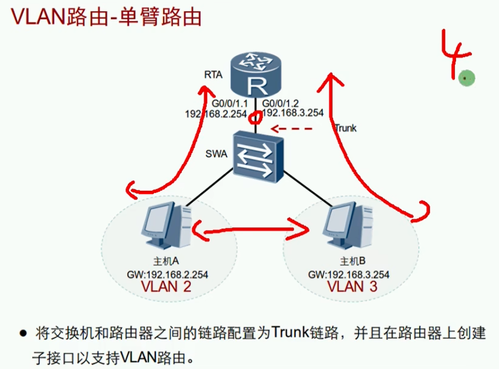
VLAN单臂路由基于出口Trunk和路由器子接口实现

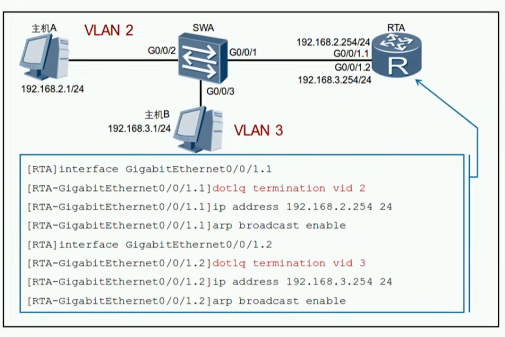


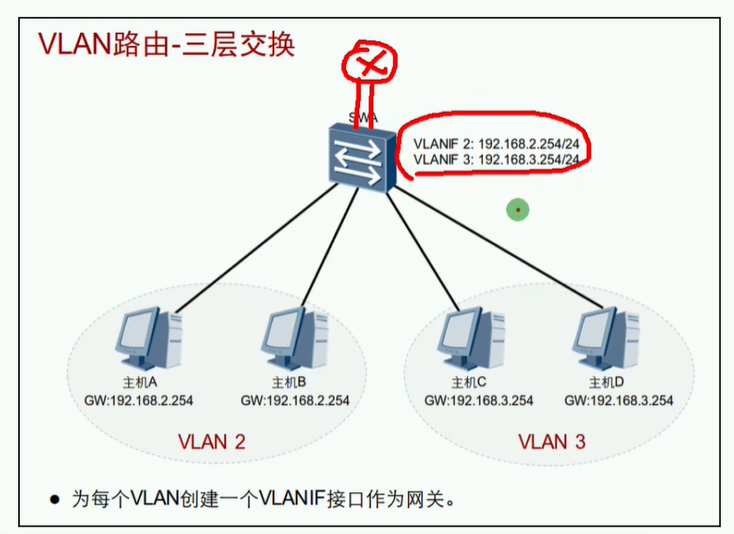
为每个vlan创建一个vlanif接口作为网关

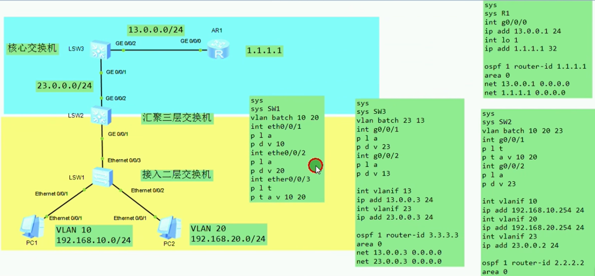

#### GVRP

通用属性注册协议
实现vlan属性的动态分发、注册、传播

为GARP协议具体实现


GARP消息类型：
- Join：端口加入vlan
- Leave：端口退出vlan
- Leave All：注销所有

GVRP注册模式：
- fixed：
- forbidden：
- normal：允许动态、静态注册vlan，同时会发送动态、静态vlan声明消息


#### STP

生成树协议
STP 使用一种分布式算法，交换机之间通过发送 BPDU（Bridge Protocol Data Unit） 的消息，协商出：
- 谁是根桥（Root Bridge）
- 到根桥的最短路径（即最小代价）
- 哪些端口需要阻塞（Blocking）来防止环路

1. 根桥选举：比对 BPDU → 确定 Root Bridge
2. 每个交换机找 Root Port（通向根桥的最佳路径）
3. 每条链路确定 Designated Port（通往段上代价最小）
4. 非 Root/Designated 的端口进入 Blocking 状态
5. 最终形成一棵树状结构，无环路


核心概念：
- 根桥 Root Bridge	整个网络的参考点（唯一），通过 BPDU 选举产生
- 根端口 Root Port	非根桥设备通向根桥的最短路径的那个端口（每个非根桥设备只有一个）
- 指定端口 Designated Port	某段链路上负责转发 BPDU 的端口（每条链路有一个）
- 非指定端口 Non-designated Port	被阻塞的端口（Blocking），避免环路


消除环路（通过构造一棵树来消除交换网络中的环路）
1. 选举一台根桥
2. 选举一个根端口
3. 选举指定端口
4. 阻塞剩余端口

根桥选举：
1. 每个交换机起初都认为自己是根桥，发送 BPDU。
2. 交换机通过比对 BPDU 中的 Root Bridge ID，选择出一个“最小”的作为根桥。
3. 比较顺序：
    1. 根桥 ID（优先级 + MAC地址）
    2. 路径成本
    3. 发送者桥 ID
    4. 端口 ID

端口角色：
- Root Port（根端口）：通向根桥的最短路径端口
- Designated Port（指定端口）：某段链路上负责转发 BPDU 的端口
- Blocked Port（阻塞端口）：为了避免环路而阻塞的端口

端口状态：
- Disabled	关闭状态，端口不工作
- Blocking	接收 BPDU，不转发数据帧
- Listening	接收、转发 BPDU，不学习 MAC，不转发数据
- Learning	开始学习 MAC 表，但不转发数据
- Forwarding	正常工作状态，收发数据和 BPDU
- (旧) Broken	Cisco 扩展状态


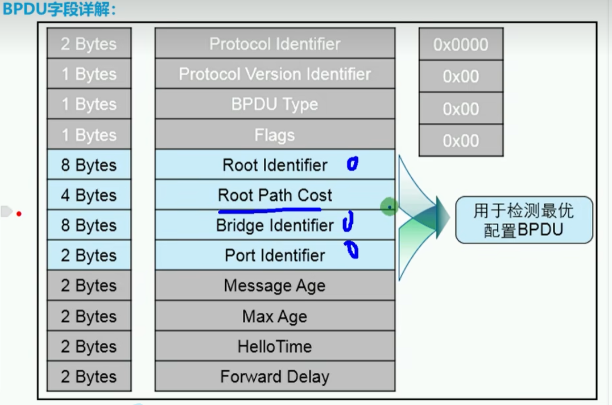

BPDU：桥协议数据单元
- 配置BPDU
- 拓扑变更通告BPDU

桥ID、端口ID
路径开销、根路径开销

BID最小的成为根桥

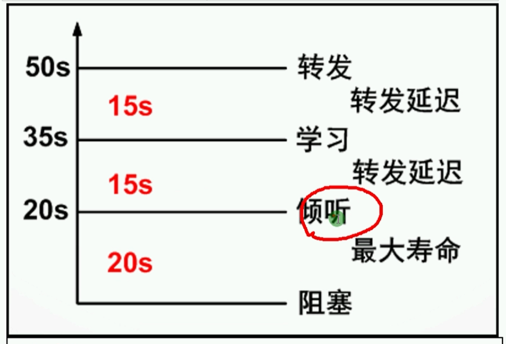

根桥故障、重新选举


#### ACL


### 路由器

任意两个接口不能配置相同网段的ip
协议是在接口上运行的


路由表
- 最长匹配原则

路由表来源：
- 直连路由：路由器接口上的网络
- 静态路由：管理员手动添加的网络
- 动态路由：路由器之间动态学习到的网络

等价路由、负载均衡
缺省路由


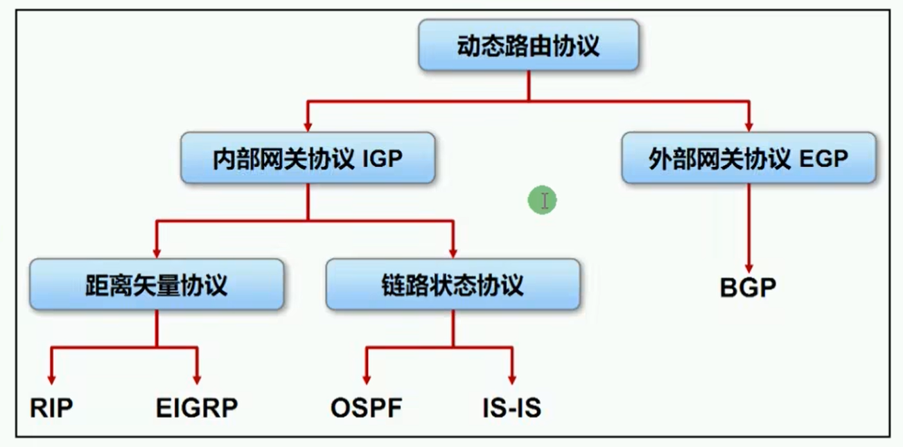

路由协议分类：
- IGP内部网关协议
- EGP外部网关协议
- AS自治系统
- DV距离矢量
- LV链路状态
- Classful有类
- Classless无类
- 单播路由协议
- 组播路由协议


#### RIP

路由信息协议
基于距离矢量、UDP，目标端口520
周期性更新
使用跳数作为衡量到达目的网络的距离，不能超过15跳，经过路由发送时跳数+1

不同的进程号属于不同的数据库


环路避免、水平分隔：禁用往返发送
30s触发更新
毒性反转


##### RIPv1

以广播的形式发送
有类、不支持认证

##### RIPv2

以组播的形式发送
无类、支持认证


#### EIGRP


#### IS-IS


#### OSPF

开放式最短路径优先协议、网络层协议
5种数据包，7种路由状态

组播、无类、以开销cost作为度量值
（224.0.0.5、224.0.0.6）
触发式更新、通过LAS的形式发布路由


区域是以接口为单位来划分的
每个ospf路由器只维护所在区域的完整链路状态信息
- 骨干区域：area0
- 非骨干区域：常规区域

区域路由器类型：（一台路由器可以属于多种类型）
- IR：内部路由器
- BR：骨干路由器
- ABR：区域边界路由器
- ASBR：自治系统边界路由器

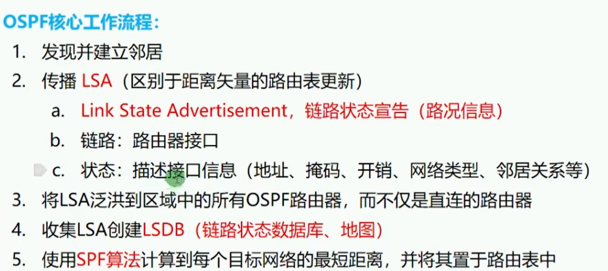

LSA泛洪建立连接、SPF算法计算最短路径，并置于路由表中
Router ID：唯一标识一台OSPF路由器
每一个运行ospf的接口上，都维护着一个接口Cost（cost计算参考带宽）


OSPF数据包：
- 类型
- Router ID
- Area ID


OSPF数据包类型：（update、ack）
- Hello：建立邻居
- Database Description
- Link-State Request
- Link-State Update
- Link-State Acknowledgment


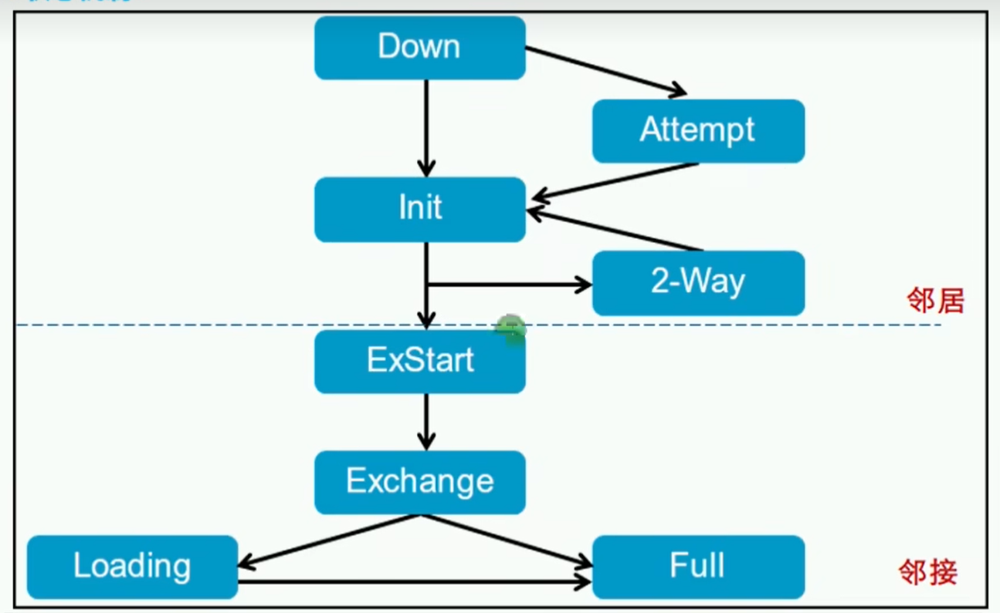
- Down
- Init
- 2-Way：收到Hello包，形成邻居关系
- ExStart：决定信息交换时路由器的主从关系
- Exchange：向邻居发送DD
- Loading
- Full：LSDB同步，形成邻接关系

Master网络选举：用于减少邻接关系
- DR：指定路由器
- BDR：备份DR
- DRothers：DRothers之间保持邻居关系，与DR、BDR之间保持邻接关系
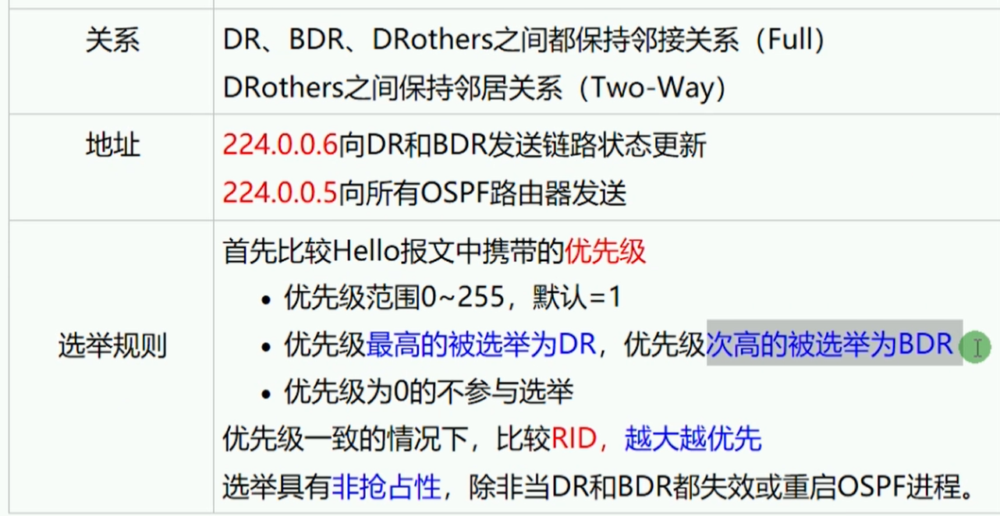


#### BGP


## 网络协议

### DNS

域名解析
应用层协议


### HTTP


### FTP


文件传输协议


### TFTP

简单文件传输协议


### SMTP


### POP3


### IMAP

类似POP3


### TELNET

远程连接


### DHCP

动态主机配置协议
自动配置IP

UDP封装，服务端67、客户端68
DHCP组成：客户端、服务端、中继

DHCP报文类型：
- DISCOVER：寻找DHCP服务器
- OFFER：响应DISCOVER报文
- REQUEST：客户端请求配置确认
- ACK：
- NAK：
- RELEASE：客户端释放地址


### TCP

传输层协议
基于port


三次握手
syn发给你的序列号、ack确认你给我的
两组syn、ack

累计确认机制、并不是每次对方的syn都必须回复ack
窗口大小机制：告知对方自己剩余窗口容量，用于流量控制

四次挥手ack、fin


### UDP

传输层协议
基于port


### ICMP
```yaml
icmp:
    0:
        0: # Echo Reply
    8:
        0: # Echo Request
```

网络层协议
消息控制协议、type、code


### IP

网络层协议


数据分片
TTL：生存事件


 


网络地址、主机地址、广播地址
单播、广播、组播
冲突域、广播域


### ARP

网络层协议
根据ip获取mac地址


### Ethernet

以太网协议、局域网组网技术


数据帧大小：64~1518
MTU: 46~1500
目标地址、源地址、类型、帧校验序列：18

数据链路层
- LLC子层
- MAC子层

MAC地址：48位、6字节


### PPP