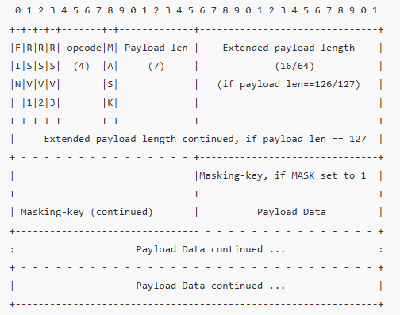

# WebSocket

## 基础介绍

基于HTTP协议

Websocket握手初始化：
- Upgrade: websocket：表示请求协议升级为 WebSocket。
- Connection: Upgrade：配合 Upgrade 字段生效。
- Sec-WebSocket-Key：客户端生成的随机 base64 字符串，用于服务端验证。
- Sec-WebSocket-Version：当前 WebSocket 协议版本，13 是主流版本。
- Sec-WebSocket-Accept 是服务端根据客户端的 Sec-WebSocket-Key 计算出的一个值，用于校验合法性

Sec-WebSocket-Key:
- 随机生成的一个 16 字节（128 位）的随机值，并用 Base64 编码发送给服务器。
- 每次请求时这个值都应该是新的，不重复

Sec-WebSocket-Accept:
`accept = base64_encode(sha1(sec_websocket_key + "258EAFA5-E914-47DA-95CA-C5AB0DC85B11"))`

Websocket数据帧：

- FIN（1 bit）：表示是否是消息的最后一个片段（1 是最后）
- Opcode（4 bit）：消息类型
    - 0x1：文本帧
    - 0x2：二进制帧
    - 0x8：关闭连接
    - 0x9：ping
    - 0xA：pong
- MASK（1 bit）：客户端发来的帧必须为 1，表示有掩码
- Payload length（7+ bit）：表示有效负载长度
    - 0~125
    - 126：后面两个字节为真实长度（16）
    - 127：后面八个字节为真实长度（64）
- Masking Key（4 bytes）：掩码值，用于混淆 payload 数据（客户端必须掩码，服务器不需要）
- Payload Data：真正要传输的数据内容

