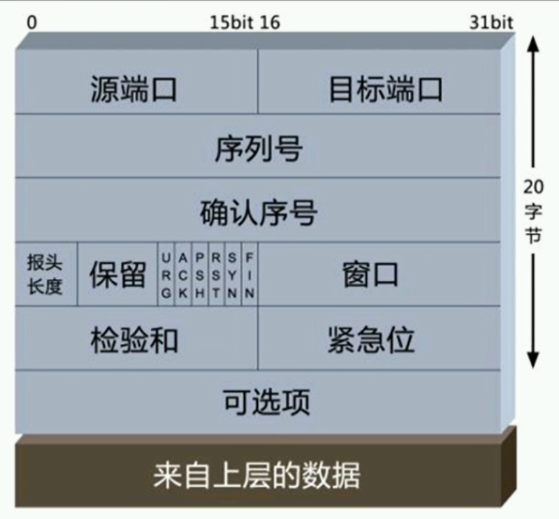
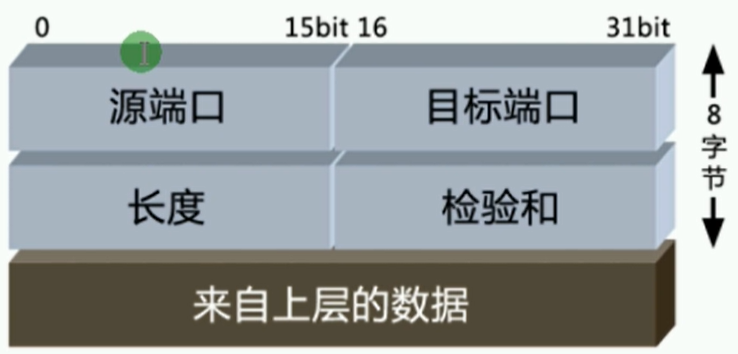

# VRP

`华为数通路由交换HCNA/HCIA：P11`

## 基础介绍


华为网络搭建模拟器


段 -> 包 -> 帧 -> 比特


## 核心内容
```yaml
eNSP:

```


## 网络协议

### DNS

域名解析
应用层协议


### HTTP


### FTP


文件传输协议


### TFTP

简单文件传输协议


### SMTP


### POP3


### IMAP

类似POP3


### TELNET

远程连接


### TCP

传输层协议
基于port



三次握手
syn发给你的序列号、ack确认你给我的
两组syn、ack

累计确认机制、并不是每次对方的syn都必须回复ack
窗口大小机制：告知对方自己剩余窗口容量，用于流量控制

四次挥手ack、fin


### UDP

传输层协议
基于port





### ICMP

网络层协议


### IP

网络层协议


### ARP

