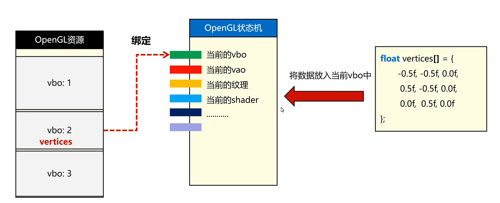

# OpenGL

`B站最好OpenGL教程：P36`

## 基础介绍

opengl核心组件：
- 渲染管线 (Rendering Pipeline)
    - 顶点处理 (Vertex Processing)：处理传入的顶点数据，如位置、法线、颜色、纹理坐标等。顶点着色器（Vertex Shader）是这一阶段的关键。
    - 图元装配 (Primitive Assembly)：将多个顶点组成基本图元（如三角形、线段或点）。
    - 光栅化 (Rasterization)：将图元转换为片段（或像素）。在这一阶段，确定哪些像素在屏幕上需要显示，并为每个像素计算颜色、深度等属性
    - 片段处理 (Fragment Processing)：通过片段着色器（Fragment Shader）对每个片段进行着色、光照、纹理映射等计算，以决定最终像素的颜色和其他特性
    - 输出合成 (Framebuffer Operations)：将最终处理后的片段合成到帧缓冲中，最终显示到屏幕上。这里包括深度测试、透明度混合等操作
- 着色器 (Shaders)：GLSL（OpenGL Shading Language）编写
    - 顶点着色器 (Vertex Shader)：用于处理每个顶点的数据，如位置、法线、颜色等。它在渲染管线的顶点处理阶段执行
    - 片段着色器 (Fragment Shader)：处理每个片段（像素）的颜色值，通常负责光照、纹理映射、颜色混合等计算。它在光栅化后的片段处理阶段执行
    - 几何着色器 (Geometry Shader)：处理图元（如点、线、三角形）之间的转换，可以生成新的顶点。它介于顶点着色器和片段着色器之间
    - 计算着色器 (Compute Shader)：不直接参与渲染管线，但可以用来执行通用计算任务，适用于图形外的计算工作
- 着色器程序 (Shader Programs)
- 缓冲区对象 (Buffers)
    - 顶点缓冲区对象 (VBO, Vertex Buffer Object)：用于存储顶点数据（如位置、法线、纹理坐标等）。
    - 索引缓冲区对象 (IBO, Index Buffer Object)：存储索引数据，用于指定如何通过顶点连接构建图元（例如三角形）
    - 帧缓冲区对象 (FBO, Framebuffer Object)：用于离屏渲染，将渲染结果存储到内存中而不是直接显示到屏幕上，可以用于后期处理、纹理生成等任务
    - 纹理缓冲区对象 (Texture Buffer Object)：用于存储纹理数据，通常是图像、视频帧等
- 帧缓冲 (Framebuffer)
    - 颜色缓冲区 (Color Buffer)：用于存储像素颜色数据
    - 深度缓冲区 (Depth Buffer)：用于存储每个像素的深度值，帮助进行深度测试
    - 模板缓冲区 (Stencil Buffer)：用于存储模板测试数据，通常用于特殊的像素操作（如剪裁、阴影等）
- 纹理 (Textures)
    - 2D 纹理：用于存储二维图像，如照片、图标等
    - 3D 纹理：用于存储三维图像（体积纹理），适用于体积渲染等应用
    - 立方体贴图：用于存储六个面（立方体）的图像，常用于环境映射、天空盒等
- OpenGL 状态机 (State Machine)
    - 当前绑定的着色器程序：指定当前使用的顶点着色器和片段着色器。
    - 当前绑定的缓冲区对象：指定当前用于渲染的顶点缓冲区、索引缓冲区等
    - 当前绑定的帧缓冲：指定当前用于渲染的帧缓冲
    - 当前的混合状态、深度测试、模板测试等：这些测试操作会影响像素的最终结果
- OpenGL 上下文 (Context)
- 视图变换与投影矩阵 (View and Projection Matrices)


Mesh网格：顶点数据
Material材质：描述物体与光发生反应
Rendering Pipeline渲染管线

GLFW：提供渲染物体接口（窗体、消息事件、窗口链接opengl）
Glad：获取系统驱动中的函数指针（opengl操作系统已经实现，需要glad去获取它的地址）

Window:
Context:
VAO:
VBO:
Shader:
ShaderProgram: 链接着色器程序


OpenGL双缓冲Buffer：在内部缓存中绘制，然后交换屏幕缓存进行显示
NDC标准化设备坐标，顶点数据使用NDC坐标


### 项目结构
```yaml
项目结构:

```


## 核心内容
```yaml
glad.h: # OpenGL 函数加载器
    gladLoadGLLoader(): # 初始化 GLAD，加载所有当前opengl版本的函数
glfw3.h: # 窗口和输入管理
    GLFWwindow: # 窗体
    glfwCreateWindow():
    glfwGetKey(): # 获取输入key
    glfwGetProcAddress(): # 获取函数地址
    glfwGetWindowUserPointer():
    glfwInit():
    glfwMakeContextCurrent(): # 窗口绑定 opengl context上下文
    glfwPollEvents(): # 分发窗体消息
    glfwSetFramebufferSizeCallback(): # 窗体变化消息
    glfwSetKeyCallback(): # 键盘输入消息
    glfwSwapBuffers(): # 交换缓冲区
    glfwTerminate(): # 清理操作
    glfwWindowHint(): # 设置opengl配置信息
    glfwWindowShouldClose(): # 检测窗体关闭
glm.hpp: # 向量库
    glm:
        mat4:
        vec3:
        lookAt():
        perspective():
        radians():
        value_ptr():
        vec3():
opengl:
    glActiveTexture(): # 激活纹理单元，可有多个纹理单元
        GL_TEXTURE0:
        GL_TEXTURE1:
    glAttachShader(): # program链接shader
    glBindBuffer(): # 绑定VBO
        GL_ARRAY_BUFFER: # 顶点缓冲区（VBO）
        GL_COPY_READ_BUFFER: # 用于读写缓冲区，特别是用于缓冲区复制操作（如通过 glCopyBufferSubData 进行数据复制
        GL_COPY_WRITE_BUFFER:
        GL_ELEMENT_ARRAY_BUFFER: # EBO存储索引数据
        GL_PIXEL_PACK_BUFFER: # 用于从帧缓冲（framebuffer）中读取像素数据，常用于纹理读取和截图
        GL_PIXEL_UNPACK_BUFFER: # 用于将像素数据从 CPU 传输到 GPU，通常用于上传纹理数据
        GL_SHADER_STORAGE_BUFFER: # 用于存储着色器数据，可以被着色器直接访问，用于计算着色器、图形着色器等
        GL_TRANSFORM_FEEDBACK_BUFFER: # 用于存储变换反馈的数据。变换反馈是指从管线中间阶段提取数据（如从顶点着色器的输出），并将其存储在缓冲区中
        GL_UNIFORM_BUFFER: # 存储 uniform 数据
    glBindTexture(): # 绑定纹理对象
        GL_TEXTURE_2D: # 绑定纹理对象为 2D 纹理
    glBindVertexArray(): # context绑定VAO
    glBufferData(): # 设置buffer数据，替换，(GLenum target,GLsizeiptr size,const void * data,GLenum usage)
        GL_ARRAY_BUFFER: # 给VBO设置数据
            GL_DYNAMIC_DRAW:
            GL_STATIC_DRAW:
    glBufferSubData(): # 设置buffer数据，部分更新
    glClear(): # 执行清屏
        GL_COLOR_BUFFER_BIT:
    glClearColor(): # 清屏颜色
    glCompileShader(): # 编译shader
    glCreateProgram(): # 创建链接着色器程序
    glCreateShader(): # 创建着色器
        GL_FRAGMENT_SHADER: # 片段着色器
        GL_VERTEX_SHADER: # 顶点着色器
    glDeleteBuffers(): # 删除指定个数的 VBO
    glDeleteProgram():
    glDeleteShader(): # 删除shader
    glDeleteVertexArrays(): # 删除VAO
    glDrawArrays(): # 绘制数组,(GLenum mode,GLint first,GLsizei count) 从当前绑定的 顶点数组对象（VAO） 中获取数据，并执行绘制操作（第二个参数为VAO索引index）
        GL_TRIANGLES: # 三角形
    glDrawElements(): # EBO 绘制
    glEnableVertexAttribArray(): # 启用顶点属性，设置当前VAO为指定索引，可针对不同VAO设置不同index，index索引是给后面shader绑定变量使用（layout(location = 0)）
    glGenBuffers(): # 创建buffer，VBO，(GLsizei n,GLuint *buffers)，可一次创建多个
    glGenerateMipmap(): # 生成多级渐远纹理（Mipmap）
    glGenVertexArrays(): # 创建顶点数组，VAO，(GLsizei n,GLuint *arrays)，可一次创建多个
    glGetError(): # 错误检查
    glGenTextures(): # 生成纹理对象，纹理需与纹理单元绑定，GL_TEXTURE0
    glGetUniformLocation(): # 获取uniform变量位置，用于后续设置uniform的值
    glLinkProgram(): # program执行链接
    glShaderSource(): # 设置shader源码
    glTexImage2D(): # 上传纹理数据到 GPU
    glTexParameteri(): # 设置纹理参数
        GL_TEXTURE_2D:
            GL_TEXTURE_MAG_FILTER:
            GL_TEXTURE_MIN_FILTER:
                GL_LINEAR:
            GL_TEXTURE_WRAP_S:
            GL_TEXTURE_WRAP_T:
                GL_REPEAT:
    glUniform1i():
    glUniformMatrix4fv(): # 设置uniform变量值
    glUseProgram(): # 使用着色器程序program
    glVertexAttribPointer(): # 配置VAO属性，告诉 OpenGL 顶点属性的格式，(GLuint index,GLint size,GLenum type,GLboolean normalized,GLsizei stride,const void * pointer)：index该顶点第几个属性、size该属性包含几个数字、type每个数字的类型、normalized归一化、stride每个顶点所有属性总长、pointer该属性在该顶点数据中的偏移量
    glViewport(): # 设置渲染视口区域
```


### Rendering Pipeline


- 顶点数据：位置、颜色、其它数据
- 三维变换：模型变换、视图变换、投影变换
- 图元装配
- 裁剪剔除
- 光栅化
- 片元着色
- 混合与测试：透明度、渲染顺序


### Shader


### Buffer

- GL_ARRAY_BUFFER	顶点缓冲区（VBO）
- GL_ELEMENT_ARRAY_BUFFER	索引缓冲区（EBO）
- GL_VERTEX_ARRAY	顶点数组对象（VAO）
- GL_TEXTURE_2D	2D 纹理对象
- GL_TEXTURE_CUBE_MAP	立方体纹理
- GL_FRAMEBUFFER	帧缓冲对象（FBO，离屏渲染）
- GL_RENDERBUFFER	渲染缓冲对象（FBO 附件）
- GL_SHADER_STORAGE_BUFFER	Shader Storage Buffer Object（高级SSBO）
- GL_UNIFORM_BUFFER	Uniform 缓冲区（UBO）
- GL_TRANSFORM_FEEDBACK_BUFFER	捕捉变换反馈输出
- GL_DRAW_FRAMEBUFFER	绘制目标帧缓冲
- GL_READ_FRAMEBUFFER	读取目标帧缓冲
- GL_COPY_READ_BUFFER	复制源缓冲区
- GL_COPY_WRITE_BUFFER	复制目标缓冲区
- GL_PIXEL_PACK_BUFFER	从 GPU 到 CPU 读取像素（截图等）
- GL_PIXEL_UNPACK_BUFFER	从 CPU 到 GPU 上传像素（纹理加载）
- GL_ATOMIC_COUNTER_BUFFER	原子计数缓冲区
- GL_DISPATCH_INDIRECT_BUFFER	GPU 端执行 compute shader 时使用
- GL_DRAW_INDIRECT_BUFFER	DrawIndirect 使用


#### VBO
```c++
// 创建一个 VBO
glGenBuffers(1, &vbo);

// 绑定 VBO
glBindBuffer(GL_ARRAY_BUFFER, vbo);

// 向 VBO 中传输数据，指定大小
glBufferData(GL_ARRAY_BUFFER, sizeof(vertices), vertices, GL_STATIC_DRAW);
```

VBO就是一块显存缓冲区，用来存你的顶点数据（在显存中）
Vertex Buffer Object、存储顶点数据（位置/颜色/纹理等）

大小不固定、在glBufferData()设置数据时动态变化


#### VAO
```c++
// 定义需要传递给shader的数据，2个属性
struct Vertex {
    glm::vec3 position;   // 位置数据
    glm::vec3 color;      // 颜色数据
};

// 绑定 VAO 和 VBO
glBindVertexArray(vao);
glBindBuffer(GL_ARRAY_BUFFER, vbo);

// 设置顶点位置的属性指针，index = 0，position
glVertexAttribPointer(0, 3, GL_FLOAT, GL_FALSE, sizeof(Vertex), (void*)0);
glEnableVertexAttribArray(0);

// 设置顶点颜色的属性指针，index = 1
glVertexAttribPointer(1, 3, GL_FLOAT, GL_FALSE, sizeof(Vertex), (void*)offsetof(Vertex, color));
glEnableVertexAttribArray(1);


// 后续在shader中使用
#version 330 core
layout(location = 0) in vec3 aPosition;  // 对应顶点位置，绑定到索引0
layout(location = 1) in vec3 aColor;     // 对应顶点颜色，绑定到索引1
out vec3 vertexColor; // 输出到片段着色器的颜色数据

void main() {
    gl_Position = vec4(aPosition, 1.0);
    vertexColor = aColor;  // 传递颜色数据
}
```

Vertex Array Object、存储VBO 的状态绑定和属性布局
VAO与VBO是多对多关系
它的作用在于封装和管理与顶点数据相关的状态，让 OpenGL 的顶点数据管理更加高效和简洁，主要用于设置VBO数据的大小和类型

基于每个顶点的所有属性数据进行配置
每个VAO可设置一个顶点的多个属性，利用index索引区分


#### EBO

EBO（Element Buffer Object，元素缓冲对象）是 OpenGL 中用来优化顶点数据绘制的一种机制，主要用于 索引绘制（Indexed Drawing）


### Texture


3D模型常见的需要加载的属性：
```yaml
3D模型:
    顶点:
        - 位置（vec3）
        - 法线（vec3）
        - UV（vec2）
        - 切线（vec3，可选）
        - 顶点颜色（vec3/vec4，可选）
    索引数组:
        - 每组三角形的索引
    纹理:
        - 漫反射贴图
        - 法线贴图
        - 高光贴图
        - 金属度贴图
        - 粗糙度贴图
    材质:
        - 固定色、Shininess 等属性
    变换矩阵: #（ 由外部应用传入）
```


### State Machine





### Context


### View & Projection

模型变换Model Matrix：把物体从局部坐标 → 世界坐标
视图变换View Matrix：把世界坐标 → 相机空间（模拟相机）
投影变换Projection Matrix：把相机空间 → 裁剪空间（投影）

MVP矩阵


## GLSL

Shader程序